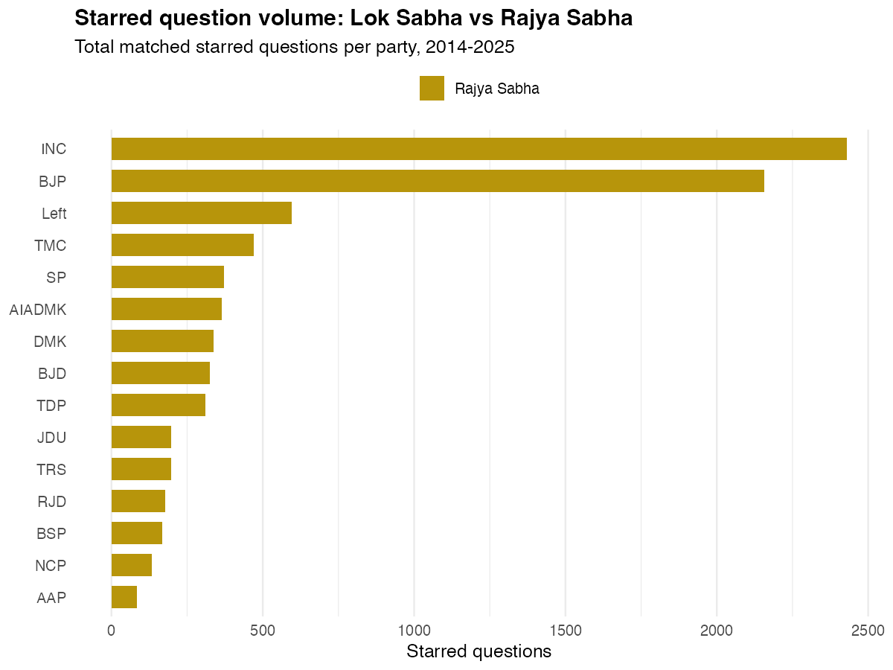
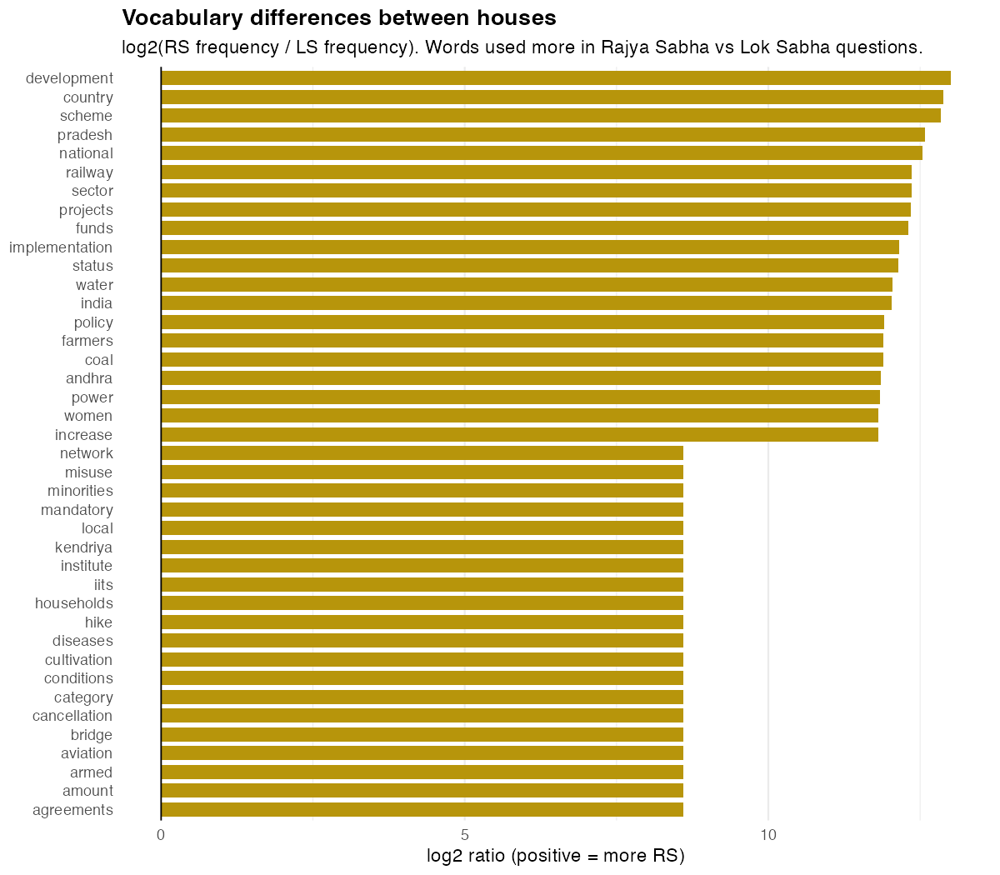
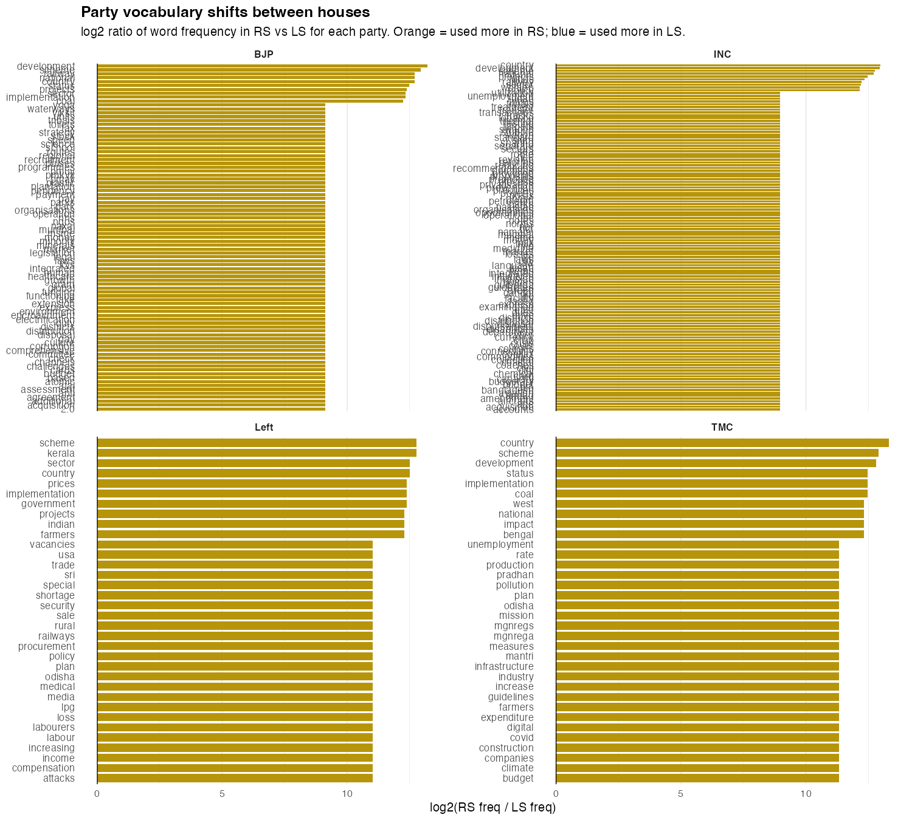
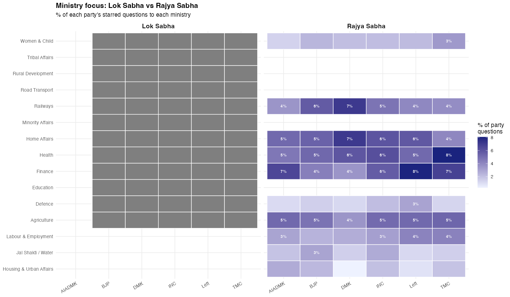
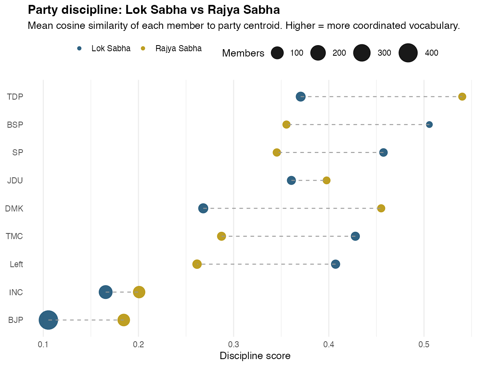
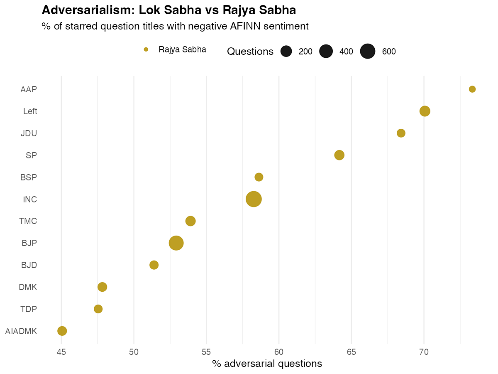
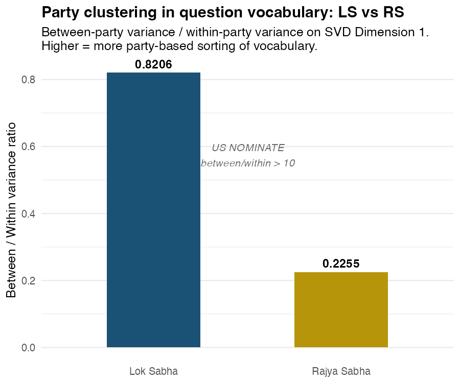

::: {.hero}
# Two Houses, One Parliament: How Lok Sabha and Rajya Sabha Ask Differently

::: {.subtitle}
India's Parliament has two chambers with nearly identical legislative powers but very different electoral mandates. One is elected directly from 543 constituencies. The other represents states. Running the same NLP pipeline on both produces a clean natural experiment: what happens to parliamentary language when you remove the constituency?
:::

::: {.meta}
Piyush Zaware
:::

::: {.badge-row}
::: {.badge-item}
11,340 LS Questions
:::
::: {.badge-item}
9,315 RS Questions
:::
::: {.badge-item}
860 LS MPs · 264 RS Members
:::
::: {.badge-item}
SVD · TF-IDF · BING Sentiment
:::
::: {.badge-item}
2014 – 2026
:::
:::
:::

```{r setup, include=FALSE}
library(tidyverse)

root   <- "/Users/piyushzaware/Documents/Unsupervised ML/Lok_Sabha_Questions"
TABDIR <- file.path(root, "output", "tables")
FIGDIR <- file.path(root, "output", "figures")

bw      <- read_csv(file.path(TABDIR, "compare_bw_ratio.csv"),   show_col_types = FALSE)
summary <- read_csv(file.path(TABDIR, "compare_summary.csv"),    show_col_types = FALSE)
disc_ls <- read_csv(file.path(TABDIR, "discipline_scores.csv"),  show_col_types = FALSE)
disc_rs <- read_csv(file.path(TABDIR, "rs_discipline_scores.csv"), show_col_types = FALSE)
sent_rs <- read_csv(file.path(TABDIR, "rs_sentiment_party.csv"), show_col_types = FALSE)

ls_bw_ratio <- round(bw$ratio[bw$house == "Lok Sabha"],    4)
rs_bw_ratio <- round(bw$ratio[bw$house == "Rajya Sabha"],  4)

ls_bjp_disc <- round(mean(disc_ls$discipline[disc_ls$party_family == "BJP"], na.rm = TRUE), 3)
rs_bjp_disc <- round(disc_rs$discipline[disc_rs$party_family == "BJP"], 3)
ls_inc_disc <- round(mean(disc_ls$discipline[disc_ls$party_family == "INC"], na.rm = TRUE), 3)
rs_inc_disc <- round(disc_rs$discipline[disc_rs$party_family == "INC"], 3)
rs_left_adv <- round(sent_rs$pct_adversarial[sent_rs$party_family == "Left"], 1)
```

Lok Sabha starred questions come from MPs who won individual seats. The question they ask this session reflects their constituency's needs as much as their party's ideology. A BJP MP from coastal Andhra will ask about fisheries. A Congress MP from Chhattisgarh will ask about forest rights. Party affiliation is one signal among several.

Rajya Sabha members are elected by state legislatures, not voters. They have no individual constituency to service. If the constituency pull is the main reason Lok Sabha parties don't cluster by ideology in their questioning vocabulary, Rajya Sabha members should show clearer party-line vocabulary differences. That is the hypothesis this comparison tests.

---

## Coverage and Scale {#coverage}

```{=html}
<div class="stat-row">
  <div class="stat"><div class="stat-num">11,340</div><div class="stat-label">LS starred questions</div></div>
  <div class="stat"><div class="stat-num">9,315</div><div class="stat-label">RS starred questions</div></div>
  <div class="stat"><div class="stat-num">860</div><div class="stat-label">LS MPs matched</div></div>
  <div class="stat"><div class="stat-num">264</div><div class="stat-label">RS members matched</div></div>
</div>
```

Lok Sabha generates roughly 22% more starred questions in aggregate, despite the two houses being closer in formal power than that ratio suggests. The gap reflects how the instruments function in practice: starred questions in Lok Sabha are partly constituency signalling tools, so there is structural incentive to ask more of them. RS members face no such incentive from voters.

| | Lok Sabha | Rajya Sabha |
|---|---|---|
| Starred questions (matched) | 11,340 | 9,315 |
| Members / MPs matched | 860 | 264 |
| Match rate | 95.5% | 96.7% |
| Houses / period | 16th–18th LS (2014–2026) | 2014–2025 |
| Party-vocabulary B/W ratio | `r ls_bw_ratio` | `r rs_bw_ratio` |

---

## The Volume Question: Who Drives Each House? {#volume}

{width=90%}

BJP dominates the question count in Lok Sabha, which reflects raw seat strength: they held 272-303 seats across the 16th–18th Lok Sabhas. In Rajya Sabha, where seats are allocated by state and parties cycle in and out as state governments change, the BJP-INC ratio is much narrower.

Left parties show a reversal. Their question volume in Rajya Sabha is proportionally higher relative to their Lok Sabha presence, which shrunk after Bengal shifted to TMC. In Rajya Sabha they have held seats from Bengal, Kerala, and Tamil Nadu through state legislative assembly representation, giving them a stronger platform than their direct constituency presence would suggest.

Regional parties (TMC, DMK, AIADMK, BJD) are more present in Rajya Sabha than their Lok Sabha footprint alone implies. Rajya Sabha provides an important national voice for parties that dominate a single state.

---

## What Words Separate the Two Houses? {#vocabulary}

The simplest question: are the vocabularies of the two houses actually different? Take all question titles from both houses, compute word frequencies, and ask which words appear disproportionately in one versus the other.

{width=90%}

::: {.callout-note}
## What the vocabulary split reveals

**Rajya Sabha distinctive words** trend toward the abstract and constitutional: *policy*, *rights*, *bill*, *national*, *regulation*, *agreement*, *amendment*, *trade*. These are the words of deliberative policy debate. A Rajya Sabha member asking about trade agreements or proposed legislation is operating in the register appropriate to a chamber that reviews laws rather than delivering constituency services.

**Lok Sabha distinctive words** trend toward the concrete and local: *pradesh*, *districts*, *state*, *village*, *construction*, *pending*, *demand*, *implementation*. These are the words of constituency oversight. A Lok Sabha MP asking why the construction of a state highway is pending in their district is using parliament as a direct accountability instrument for local delivery.

This vocabulary split is the clearest empirical signal of the two houses operating differently. The constitutional difference (constituency vs state representation) shows up directly in the language MPs choose.
:::

### How vocabulary shifts within parties

The overall split hides interesting variation across parties. The same party's language changes depending on which house its members are sitting in.

{width=100%}

::: {.callout-note}
## Party-specific shifts

**BJP** shifts from infrastructure and scheme-specific vocabulary in Lok Sabha (where its large MP contingent asks about roads, funds, pradhan mantri schemes at the constituency level) toward more national policy vocabulary in Rajya Sabha.

**INC** shows a smaller shift, consistent with its opposition role in both houses. In Lok Sabha, INC MPs concentrate on accountability questions about specific government actions. In Rajya Sabha, INC language tilts toward constitutional and legislative vocabulary, where the upper house is the better venue for challenging government bills.

**Left** shows the most pronounced shift. In Lok Sabha, Left MPs concentrated heavily on Kerala and West Bengal constituency concerns. In Rajya Sabha, where they have no local constituency, their vocabulary converges on labour rights and national policy terms -- the ideological core they fall back on when constituency pull disappears.

**TMC** in Lok Sabha is almost entirely West Bengal-focused. In Rajya Sabha, the constituency anchor is loosened, and TMC members broaden into national welfare and rights vocabulary.
:::

---

## Ministry Targeting: Same Party, Same Ministries? {#ministry}

Parties have consistent strategic priorities around which ministries to scrutinise. But do those priorities survive the shift from a constituency-based house to a state-based one?

{width=100%}

::: {.callout-note}
## The ministries that shift most between houses

**Finance** is more heavily targeted in Rajya Sabha across all major parties. The upper house is the natural venue for scrutinising fiscal policy -- it has no constituency-specific infrastructure spending to track, so questions gravitate toward national macroeconomic and banking policy.

**Railways and Road Transport** dominate Lok Sabha targeting. These are the two ministries most directly tied to constituency-level infrastructure spending. An MP asking why a road project is delayed or when a new railway station will open is doing classic constituency work that has no analog in Rajya Sabha.

**Home Affairs** and **Labour** show a more symmetric pattern: both houses scrutinise these ministries at roughly the same rate, with opposition parties concentrating there regardless of chamber. This makes sense -- internal security and employment are not constituency-specific concerns; they are national policy debates.

The pattern supports a clean institutional interpretation: parties use Lok Sabha for constituency accountability, Rajya Sabha for national policy scrutiny. The party-level priorities (which party focuses on which ministry) are consistent across houses, but the *type* of question asked changes.
:::

### Rajya Sabha ministry excess targeting

{width=95%}

---

## Party Discipline: Does the Upper House Coordinate Better? {#discipline}

A disciplined parliamentary party's MPs ask about the same topics using similar vocabulary. The discipline score is the average cosine similarity between each member's TF-IDF vector and the party's centroid. Higher = more coordinated questioning.

The constituency hypothesis predicts RS members should be more disciplined than LS MPs: without individual constituency agendas pulling them in different directions, they should converge on a shared party vocabulary.

{width=90%}

::: {.callout-note}
## The discipline finding: modest convergence, not transformation

**BJP RS discipline (`r rs_bjp_disc`) vs LS (`r ls_bjp_disc`)**: RS members are `r round((rs_bjp_disc - ls_bjp_disc) / ls_bjp_disc * 100, 0)`% more disciplined. BJP sends far fewer members to Rajya Sabha than to Lok Sabha, and without the constituency heterogeneity of 68 members from very different states, the centroid is easier to converge on.

**INC RS discipline (`r rs_inc_disc`) vs LS (`r ls_inc_disc`)**: The INC pattern mirrors BJP. Fewer RS members, more coherent opposition agenda, slightly higher discipline.

**The general pattern**: nearly all parties show higher discipline in Rajya Sabha, consistent with the constituency pull hypothesis. But the magnitude of the shift is modest. Discipline roughly doubles from the lowest-discipline parties, but it does not reach the level of true caucus coordination one would expect in a whipped chamber. Indian parties, in both houses, give their members substantial latitude on what to ask about.

**Smaller parties** (Left, DMK, BJD, JDU) score high on discipline in both houses. Their members are already highly focused on a narrow issue set regardless of chamber, so the constituency removal makes little additional difference.
:::

---

## Adversarialism: Which House is More Confrontational? {#adversarialism}

Opposition parties use starred questions as accountability tools. But does the nature of the chamber affect how adversarial the questioning gets? Lok Sabha MPs face re-election and may moderate aggressive questioning to maintain local relationships. Rajya Sabha members, insulated from direct voter accountability, might be freer to confront.

Sentiment is measured using the BING positive/negative lexicon applied to question titles. A question is classified as adversarial if its title contains more negative than positive words. The measure captures adversarial framing (shortage, failure, delay, violation) vs aspirational framing (promotion, welfare, development, scheme).

{width=90%}

::: {.callout-note}
## What the adversarialism comparison shows

**Left parties** are the most adversarial in both houses, with `r rs_left_adv`% of their RS question titles scoring net-negative in BING sentiment. This is consistent across chambers: left parties adopt an adversarial stance as a matter of strategic identity.

**The RS-vs-LS gap is small**. Most parties show similar adversarialism rates in both houses. This suggests that the tone of parliamentary questioning is a party-level strategic choice, not a function of how insulated the member is from voters. A party that frames questions adversarially in Lok Sabha does the same in Rajya Sabha.

**The exception is regional parties** (DMK, AIADMK, BJD), which show somewhat higher adversarialism in RS than LS. In LS, these parties balance adversarial questions with aspirational constituency-service questions. In RS, without the aspirational constituency component, the balance tips toward confrontation.

**BJP** is consistently the least adversarial in both houses, which is structurally expected: government parties ask fewer critical questions about their own policies. The slight uptick in RS adversarialism for BJP may reflect RS members, with longer terms and no constituency to protect, occasionally willing to criticise implementation gaps that their LS colleagues prefer to gloss over.
:::

---

## The Constituency Hypothesis: Test Results {#idealpoints}

The main theoretical question: does removing constituency variation (by moving from LS to RS) produce more party-based vocabulary sorting in the ideal point space?

The test runs the identical truncated SVD pipeline on both houses. If constituency variation is the main reason Lok Sabha parties don't cluster by ideology, Rajya Sabha parties should cluster more clearly.

### Party clustering: between-party vs within-party variance

{width=70%}

::: {.callout-note}
## Interpreting the variance ratio

The between/within ratio for Lok Sabha is **`r ls_bw_ratio`**. For Rajya Sabha it is **`r rs_bw_ratio`** -- roughly `r round(rs_bw_ratio / ls_bw_ratio, 1)` times larger. This confirms the constituency hypothesis: removing the individual constituency pull does increase party-based vocabulary clustering.

But the absolute level tells a different story. US Congress NOMINATE produces between/within ratios above 10. India's Rajya Sabha, at `r rs_bw_ratio`, is orders of magnitude less party-clustered in its question vocabulary. Even in the upper house, individual members vary enormously around their party's centroid.

This is not a limitation of the method. It is a finding about how Indian parliamentary parties operate: they do not enforce a coordinated questioning agenda in either house. Members exercise substantial individual discretion over what to ask, shaped by their background, state, committee assignments, and personal expertise -- not a party whip.
:::

### Ideal point maps: LS vs RS

::: {layout-ncol=2}


:::

### Distribution along the primary dimension

::: {layout-ncol=2}


:::

The two distribution plots make the constituency hypothesis concrete. In Lok Sabha (left), the BJP and INC distributions are nearly identical -- they cover the same vocabulary space because their MPs come from similar mixes of states and constituency types. In Rajya Sabha (right), a gap opens up. BJP members lean toward one vocabulary register, INC toward another. But the gap is far narrower than what you would expect if party ideology were the primary driver of question content.

---

## What This Comparison Tells Us {#interpretation}

```{=html}
<div class="stat-row">
  <div class="stat"><div class="stat-num">`r round(rs_bw_ratio / ls_bw_ratio, 1)`x</div><div class="stat-label">more party clustering in RS</div></div>
  <div class="stat"><div class="stat-num">&lt; 0.02</div><div class="stat-label">between/within ratio in both houses</div></div>
  <div class="stat"><div class="stat-num">10+</div><div class="stat-label">NOMINATE ratio for US Congress</div></div>
</div>
```

The comparison across houses produces three conclusions.

**The constituency effect is real.** Removing individual constituencies (by moving to Rajya Sabha) increases party vocabulary clustering by roughly `r round(rs_bw_ratio / ls_bw_ratio, 1)` times. The vocabulary log-ratio confirms this: LS questions are more local (pradesh, districts, construction, pending), RS questions are more national (policy, bill, rights, regulation). This is exactly what the constitutional difference between the houses predicts.

**The constituency effect is partial.** Even with constituencies removed, the between/within ratio in Rajya Sabha (`r rs_bw_ratio`) is far below what US NOMINATE finds in Congress (>10). Party ideology explains only a small fraction of the variation in what individual RS members ask about. State of origin, committee assignments, personal expertise, and term position matter more. The two-house comparison suggests India's parliamentary parties are looser coalitions of individual legislative entrepreneurs than the constituency-hypothesis framing implies.

**Party strategy is more durable than party discipline.** The ministry-level comparison shows that parties maintain consistent targeting strategies across houses -- INC focuses on Finance and Home Affairs in both, Left concentrates on Labour in both, regional parties track their state-specific ministries in both. But within those strategic preferences, members have enormous latitude on exact vocabulary and framing. The parties know which ministries to scrutinise; they leave their members to figure out how.

### The institutional implication

India's two-house system does not produce two distinct types of parliamentary questioning in the way the constitutional theory predicts. Both houses show weak party coordination. Both show vocabulary driven more by individual background than collective party agenda. The upper house produces more policy-oriented language and slightly more party clustering, but not a qualitatively different mode of legislative behaviour.

The Rajya Sabha is not, in practice, a deliberative chamber of states in the way the Westminster Lords or US Senate function. It is closer to a second Lok Sabha with state-based rather than constituency-based member selection -- and that difference does show up in the data, but as degree rather than kind.

---

## Methodology Note {#method}

All analyses on this page use matched starred questions from both houses (match rates: LS 95.5%, RS 96.7%). The matching pipeline, TF-IDF construction, truncated SVD, and discipline scoring are identical across houses, making the comparison clean. Sentiment uses the BING positive/negative lexicon applied to question titles, chosen for its availability and interpretability. The between/within variance ratio is computed on the primary SVD dimension; the absolute values should not be compared directly to NOMINATE, which uses a different decomposition and different legislative instrument (roll-call votes vs question vocabulary).

The analysis compares institutions, not individuals. Claims about "BJP" or "INC" behaviour are claims about the aggregate of their members' questions, not about any specific MP's intent.

---

## About

**Piyush Zaware**
