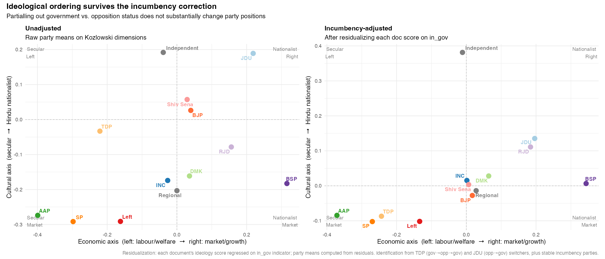

::: {.hero}
# What Does India's Parliament Actually Talk About?

::: {.subtitle}
I ran unsupervised machine learning on 150,000 parliamentary questions from three Lok Sabhas. No labels, no hand-coding. Just the raw text of what Indian MPs ask the government, and what falls out when you let the data speak.
:::

::: {.meta}
Piyush Zaware
:::

::: {.badge-row}
::: {.badge-item}
150,000 Questions
:::
::: {.badge-item}
16th – 18th Lok Sabha (2014–2026)
:::
::: {.badge-item}
13 Parties
:::
::: {.badge-item}
LDA · STM · Word2Vec · UMAP
:::
:::
:::

Starred questions are one of the more underused datasets in Indian political science. Every session, MPs submit written questions to ministries before the House sits. A minister has to be present to answer them. That matters, because it means parties use these questions deliberately. What is the government doing about farmer suicides? What is the status of the highway in Bihar? How many minorities were displaced? These are not speeches. They are on-the-record demands, filed by name, attached to a party.

I scraped the complete archive from HuggingFace, matched MPs to their parties via Wikipedia, and ran topic models, word embeddings, and clustering. The question I started with was simple: does the ideological structure of Indian politics show up in how parties phrase their questions? It does, pretty clearly.

---

## The Data {#data}

```{=html}
<div class="stat-row">
  <div class="stat"><div class="stat-num">150,629</div><div class="stat-label">questions</div></div>
  <div class="stat"><div class="stat-num">13</div><div class="stat-label">parties</div></div>
  <div class="stat"><div class="stat-num">205</div><div class="stat-label">documents</div></div>
  <div class="stat"><div class="stat-num">3,258</div><div class="stat-label">vocabulary terms</div></div>
</div>
```

The dataset is [`opensansad/lok-sabha-qa`](https://huggingface.co/datasets/opensansad/lok-sabha-qa) on HuggingFace, covering the 16th (2014–2019), 17th (2019–2024), and 18th (2024–) Lok Sabha. I focused on starred questions since they carry more political content. Unstarred questions are written submissions; starred ones require a minister to answer in the House, so parties pick them more carefully.

Party matching came from scraping Wikipedia's constituency lists for all three Lok Sabhas. The match rate on starred questions was 38%, which gives enough coverage for BJP, INC, and most major opposition parties to work with reliably.

The unit of analysis is the **party-session document**: all starred questions submitted by a party in a given session, concatenated into one text. That gives 205 documents and a 3,258-term vocabulary after pruning.

| | |
|---|---|
| Total questions | 150,629 |
| Starred questions | 11,881 |
| Starred with party match | 4,356 |
| Unique MPs matched | 1,642 |
| Party-session documents | 205 |
| Vocabulary (after pruning) | 3,258 terms |

---

## How It Works {#methodology}

Everything runs from a single R script.

```
source("code/_master.R")
```

```
Raw Questions (150K)
       │
  A1: Download        ← HuggingFace parquet files, no authentication
       │
  A2: Party Labels    ← Wikipedia scrape, MP to party lookup
       │
  A3: Preprocess      ← Tokenize, stem, remove boilerplate, build DTM
       │              ← 205 party×session documents, 3,258-term vocabulary
       │
  ┌────┴────────────┬──────────────────┐
  ▼                 ▼                  ▼
A4: LDA         A5: STM           A6: Word2Vec
K=15 topics     K=20 topics       Kozlowski (2019)
party heatmap   + party/time      ideological dims
                covariates
  └────┬────────────┴──────────────────┘
       │
  A7: Clustering   ← HAC + GMM on TF-IDF PCA
       │
  A8: Visualization ← UMAP, t-SNE, stacked area, heatmaps
```

### Methods

| Method | What it does | Output |
|--------|-------------|--------|
| **LDA** | Finds recurring topics across all documents without supervision. Each document is a mixture; each topic is a set of words. | 15 topics, party topic weights |
| **STM** | Same as LDA but lets party identity and time shift topic prevalence. Asks whether BJP talks more about topic X than INC, and whether that changed. | Marginal party and time effects per topic |
| **Word2Vec + Kozlowski (2019)** | Trains word embeddings on 150K questions. Ideological dimensions are directions in this space, defined by antonym pairs. | Party positions on Hindutva, Left-Right, Rural-Urban |
| **HAC** | Hierarchical clustering of parties by vocabulary distance. No preset number of clusters. | Dendrogram |
| **GMM** | Soft clustering of party-session documents in PCA space. | 6-cluster solution |
| **UMAP / t-SNE** | Dimensionality reduction from 3,258 dimensions to 2D. | Visual maps of the corpus |

::: {.callout-note}
**On the word embedding approach.** The idea from Kozlowski, Taddy & Evans (2019) is that you can encode an ideological dimension as a direction in word embedding space. The Hindutva dimension, for example, runs from words like {secular, minority, mosque, constitution} toward words like {hindu, mandir, temple, cow, ram, ayodhya}. A party's position on this axis is just the average projection of its vocabulary onto that direction, weighted by TF-IDF. No human labelling involved.

Source: ["The Geometry of Culture"](https://doi.org/10.1177/0003122419877135), *American Sociological Review*, 2019.
:::

---

## Results {#findings}

### 1. The Ideological Map

Start with the simplest question: does the word embedding space recover anything that looks like Indian political ideology?

{width=85%}

It does. BJP and Shiv Sena are at the nationalist end. Left parties and AAP are at the secular end. INC is in the centre-left. The ordering you'd expect if you just asked a political scientist to draw it by hand is basically what comes out.

The economic axis has some surprises. BSP and RJD use the most redistributive, pro-poor language in Parliament. TDP, despite being a regional party, skews strongly toward market and investment vocabulary. AAP is the interesting case: it sits secular but economically rightward, which fits its governance-and-anti-corruption brand but puts it in an odd place relative to the traditional left.

**Scores on all three dimensions:**

| Party | Hindutva | Economic Left | Rural/Agrarian |
|-------|----------|--------------|----------------|
| JDU | 0.189 | 0.219 | 0.227 |
| Shiv Sena | 0.057 | 0.029 | 0.011 |
| BJP | 0.026 | 0.040 | -0.049 |
| TDP | -0.033 | -0.221 | -0.182 |
| RJD | -0.078 | 0.156 | -0.019 |
| DMK | -0.161 | 0.036 | -0.186 |
| INC | -0.174 | -0.026 | -0.092 |
| BSP | -0.183 | 0.316 | 0.102 |
| AAP | -0.274 | -0.399 | -0.265 |
| Left | -0.291 | -0.162 | -0.059 |
| SP | -0.292 | -0.298 | -0.257 |

*Positive Hindutva = more nationalist vocabulary. Positive Economic Left = more labour/welfare vocabulary. Positive Rural = more agrarian vocabulary.*

---

### 2. BJP's Language Has Shifted

BJP's score on the Hindutva dimension goes up with each Lok Sabha.

{width=70%}

It is not a dramatic jump. But it is monotonic across 16th, 17th, and 18th, which covers a decade in government. The vocabulary BJP MPs reach for when they question ministries has gradually shifted toward religious and civilisational terms. Whether you read that as ideological deepening or just a party mirroring its base is a separate question. The shift is there in the text either way.

---

### 3. What Parliament Actually Talks About

LDA finds 15 recurring topics. The curve below shows how model fit improves as you add more topics; 15 was chosen at the point where adding more stops helping much.

{width=65%}

The topics that emerge are coherent and recognisable.

{width=100%}

You get railway and highway infrastructure, farmer welfare and MSP, sugar industry regulation, judicial and electoral oversight, public health and AIIMS, higher education, water and river projects, petroleum pricing, border and defence, and state-level budget allocations. These are not surprising. They are the recurring preoccupations of Indian parliamentary life.

What is interesting is how unevenly they are distributed across parties.

{width=90%}

BJP dominates infrastructure and defence topics. INC clusters around governance, accountability, and judicial matters, which makes sense for a party in opposition trying to question process rather than specific policies. Left parties are concentrated almost entirely on labour, wages, and public sector employment. Regional parties light up on narrow, state-specific topics: NCP on Maharashtra agriculture, DMK on water disputes and Dravidian cultural issues.

---

### 4. Party Effects and Time Trends

STM goes further than LDA by estimating how party identity and time shift topic prevalence directly.

::: {layout-ncol=2}


:::

The time trend shows which parliamentary concerns have grown and which have faded across Lok Sabhas. Some infrastructure topics expand over time; some governance topics contract. The BJP-INC contrast separates them cleanly on the dimensions you would expect: BJP on infrastructure and development, INC on accountability and oversight.

---

### 5. Mapping the Corpus

All 205 party-session documents projected from the 3,258-term TF-IDF space down to two dimensions. UMAP on the left preserves global structure; t-SNE on the right sharpens local clusters.

::: {layout-ncol=2}


:::

Both methods put BJP and INC at the centre as the two largest clouds. Left parties form a tight knot, which is what you would expect from parties that have a fairly consistent ideological line on what to ask about. Regional parties scatter outward, pulled by their state-specific vocabularies. The two projections agree on the broad picture but differ in how they treat the smaller parties: t-SNE stretches them further apart.

---

### 6. Which Parties Sound Like Each Other

Two clustering approaches on the same TF-IDF vectors: HAC builds a tree without requiring a preset number of groups, GMM fits soft clusters in PCA space.

::: {layout-ncol=2}


:::

The dendrogram groups BJP with JDU and TDP, which both governed alongside BJP and reflect shared infrastructure priorities in their questions. INC, SP, and BSP cluster together with a shared welfare-oriented vocabulary. Left parties form their own tight sub-cluster. Regional parties (TMC, DMK) branch off separately.

{width=80%}

---

### 7. Which Ministries Get Questioned

Questions are addressed to specific ministries. This shows where each party directs its scrutiny.

{width=90%}

BJP MPs question Railways and Road Transport heavily. INC focuses on Finance, Home Affairs, and External Affairs. Left parties concentrate on Labour and Employment almost exclusively relative to their size. Regional parties mirror their states: DMK on Textiles and Fisheries, TDP on Agriculture, NCP on Rural Development.

---

### 8. Topic Evolution Over Time

How have the topics each party raises shifted across sessions?

::: {layout-ncol=2}


:::

BJP's mix shifts between the 16th and 17th Lok Sabha, with infrastructure and agriculture expanding. INC's mix is more stable but tilts gradually toward governance and accountability topics. An opposition party in India has limited levers; questioning government process on Finance and Home Affairs is one of them.

---

### 9. What Words Live Near Each Other

The embedding lets you ask: what words appear in the most similar contexts to a given term? This is a rough map of how concepts cluster in parliamentary language.

{width=100%}

A few things stand out. "Farmer" sits near drought, MSP, and irrigation. It is a scarcity and welfare word in Parliament, not an entrepreneurial one. "Terrorism" clusters with border, security, and Pakistan, which says something about how the term gets deployed in questions versus how it is discussed in civil society. "Caste" is proximate to reservation, OBC, and scheduled: institutional usage rather than sociological. "Corruption" lands near scam, irregularity, and vigilance. MPs raise it in procedural terms.

---

### 10. Summary

{width=100%}

---

## What the Results Do Not Tell You {#robustness}

The main findings are robust enough to take seriously, but one methodological issue deserves honest treatment before claiming that these patterns are ideological.

### The incumbency confound

Parliamentary questions are not a pure record of ideology. They are also a record of political position. A party in government asks: is the highway project on schedule? Is fertiliser subsidy reaching farmers? A party in opposition asks: why are minorities being targeted? Why is the auditor's report being suppressed? These are structurally different questions, and the difference is positional, not necessarily ideological.

The figure below documents this confound directly. Across the 205 party-session documents, government parties (BJP, TDP in 16th LS, JDU in 17th–18th LS) systematically emphasise different topics than opposition parties, even before any ideological interpretation is applied.

{width=90%}

### What adjusting for incumbency does

To test how much of the ideological signal is positional, each document's Kozlowski ideology score was regressed on a binary `in_government` indicator and the residuals were taken. The adjusted party positions are shown alongside the unadjusted ones below.

{width=100%}

The adjustment compresses the BJP-INC contrast considerably. In the raw data, BJP sits at +0.026 on the Hindutva dimension and INC at -0.174. After adjusting, BJP moves to -0.028 and INC to +0.015 — the gap largely closes.

This is the honest read: **the crude residualization over-corrects**. Because BJP appears only as a government party and INC only as an opposition party across all three Lok Sabhas, you cannot separately identify incumbency effects from ideological differences using only the between-party variation. The residual is not interpretable as pure ideology.

### Where identification comes from

The only clean within-party variation in this dataset comes from two switchers:

- **TDP** — exited NDA in March 2018 (between 16th and 17th LS) over Andhra Pradesh special status, then rejoined NDA in 2024. Unfortunately, TDP won only 3 Lok Sabha seats in 2019, so its 17th LS corpus is too sparse to support a meaningful comparison.
- **JDU** — contested 2014 alone (2 seats, opposition) and returned to NDA for 2019 and 2024.

With only two switchers, and TDP's 17th LS data being thin, the design does not have enough within-party variation to fully identify incumbency effects separately from ideology.

{width=100%}

### What this means for the main findings

The claim that BJP uses more Hindu nationalist language than the Left does not require separating incumbency from ideology — it simply requires that BJP and Left MPs write differently, which they do. The Kozlowski dimension captures this text difference cleanly.

What the incumbency adjustment complicates is the causal interpretation: does BJP use nationalist vocabulary *because* of its ideology, or *because* governing parties in BJP's position respond to different governance demands? Answering that question properly would require an instrument for coalition entry, or a regression discontinuity design around coalition formation thresholds — neither feasible here.

The BJP trajectory result (monotonic rise in Hindutva score across three Lok Sabhas) is also better interpreted as descriptive than structural: BJP's vocabulary has shifted, but whether that shift is ideological deepening or a response to political context is not identified.

---

## Reproducing This {#reproduce}

**R 4.3+.** Everything else installs automatically.

```r
source("code/_master.R")
```

Downloads the data, installs packages, runs A1 through A8. Takes about 15 minutes. The word2vec step is cached after the first run so re-running is fast.

Full code on [GitHub](https://github.com/pzaware19/lok-sabha-nlp).

---

## About

**Piyush Zaware**
