::: {.hero}
{.hero-img}

# What Does India's Parliament Actually Talk About?

::: {.subtitle}
I ran unsupervised machine learning on 150,000 parliamentary questions from three Lok Sabhas. No labels, no hand-coding. Just the raw text of what Indian MPs ask the government, and what falls out when you let the data speak.
:::

::: {.meta}
Piyush Zaware
:::

::: {.badge-row}
::: {.badge-item}
150,000 Questions
:::
::: {.badge-item}
16th – 18th Lok Sabha (2014–2026)
:::
::: {.badge-item}
13 Parties
:::
::: {.badge-item}
LDA · STM · Word2Vec · UMAP
:::
::: {.badge-item}
BERTopic · VADER · spaCy NER
:::
::: {.badge-item}
Co-questioning Network · igraph
:::
:::
:::

::: {.lead-para}
Every parliamentary session, Indian MPs file written questions to ministries before the House sits. A minister must be present to answer them -- which means parties choose what to ask carefully. These are not speeches or votes. They are on-the-record demands, filed by name, attached to a party: what is the government doing about farmer suicides, the highway in Bihar, the displaced minorities. Across three Lok Sabhas (2014-2026), that record runs to 150,000 questions.

This project applies unsupervised machine learning to that corpus -- topic models, word embeddings, network analysis, ideal point estimation -- without any hand-labelling. The question: does the ideological and institutional structure of Indian politics show up in the language parties choose when they have a minister's attention?
:::

::: {.abstract-box}
**Five findings from 150,000 starred questions**

1. **Party ideology is visible, but weaker than expected.** BJP's governing-party vocabulary (scheme rollouts, infrastructure achievements) separates cleanly from opposition language (delays, failures, accountability). But between-party variance is less than 1× within-party variance -- far below what US Congressional roll-call votes show. Indian starred questions are not party-whipped.

2. **The dominant signal is constituency, not party.** MPs from agrarian districts ask about MSP and crop insurance regardless of which party they belong to. The ideal point space recovers geographic and sectoral cleavages, not left-right ideology. Party affiliation explains a surprisingly small fraction of what any individual MP asks about -- who they represent matters more than who they represent it for.

3. **Rajya Sabha shows more party clustering -- but not much more.** RS members represent states, not constituencies. Removing the constituency pull widens the BJP-INC vocabulary gap 8-fold and roughly doubles party discipline. The upper house is not purely a constituency-service instrument. But within-party variance still dominates in both chambers; the party whip does not reach starred questions.

4. **BJP's question language has shifted toward welfare-state vocabulary across three parliaments.** Topic models and word embeddings both capture the drift: infrastructure-heavy language in the 16th LS gives way to social scheme vocabulary (PM-KISAN, Ayushman Bharat, Jan Dhan) in the 17th and 18th. The Hindutva dimension remains a stable BJP signal throughout -- it does not fade as welfare vocabulary grows.

5. **Regional parties concentrate their parliamentary access on specific state grievances.** DMK over-questions communications and railways at 2× the expected rate. TDP over-questions finance by 2.7× -- almost entirely about Andhra bifurcation compensation. In Rajya Sabha, where these parties lack the LS seat share to set the agenda, the concentration intensifies: question slots are too scarce to waste on anything but the core state issue.
:::

## The Data {#data}

```{=html}
<div class="stat-row">
  <div class="stat"><div class="stat-num">150,629</div><div class="stat-label">questions</div></div>
  <div class="stat"><div class="stat-num">13</div><div class="stat-label">parties</div></div>
  <div class="stat"><div class="stat-num">205</div><div class="stat-label">documents</div></div>
  <div class="stat"><div class="stat-num">3,258</div><div class="stat-label">vocabulary terms</div></div>
</div>
```

{.era-img width=100%}

The dataset covers the 16th (2014-2019), 17th (2019-2024), and 18th (2024-) Lok Sabha. I focused on starred questions since they carry more political content. Unstarred questions are written submissions; starred ones require a minister to answer in the House, so parties pick them more carefully.

Matching MPs to their parties requires handling a consistent set of problems in the raw records: honorific prefixes in varying formats (Dr., Prof., Adv.), word-order reversals across data sources, compound initials, and spelling variation. A multi-pass normalization pipeline resolves these, achieving a 95.5% match rate on starred questions across all major parties and all three Lok Sabhas. The remaining 4.5% are Tamil Nadu AIADMK MPs from the 16th Lok Sabha whose names were absent from the Wikipedia constituency lists used as the lookup source.

The unit of analysis is the **party-session document**: all starred questions submitted by a party in a given session, concatenated into one text. That gives 205 documents and a 3,258-term vocabulary after pruning.

| | |
|---|---|
| Total questions | 150,629 |
| Starred questions | 11,881 |
| Starred with party match | 11,340 |
| Unique MPs matched | 1,215 |
| Party-session documents | 205 |
| Vocabulary (after pruning) | 3,258 terms |

## Methods {#methodology}


| Method | What it does | Output |
|--------|-------------|--------|
| **LDA** | Finds recurring topics across all documents without supervision. Each document is a mixture; each topic is a set of words. | 15 topics, party topic weights |
| **STM** | Same as LDA but lets party identity and time shift topic prevalence. Asks whether BJP talks more about topic X than INC, and whether that changed. | Marginal party and time effects per topic |
| **Word2Vec + Kozlowski (2019)** | Trains word embeddings on 150K questions. Ideological dimensions are directions in this space, defined by antonym pairs. | Party positions on Hindutva, Left-Right, Rural-Urban |
| **HAC** | Hierarchical clustering of parties by vocabulary distance. No preset number of clusters. | Dendrogram |
| **GMM** | Soft clustering of party-session documents in PCA space. | 6-cluster solution |
| **UMAP / t-SNE** | Dimensionality reduction from 3,258 dimensions to 2D. | Visual maps of the corpus |

::: {.callout-note}
**On the word embedding approach.** The idea from Kozlowski, Taddy & Evans (2019) is that you can encode an ideological dimension as a direction in word embedding space. The Hindutva dimension, for example, runs from words like {secular, minority, mosque, constitution} toward words like {hindu, mandir, temple, cow, ram, ayodhya}. A party's position on this axis is just the average projection of its vocabulary onto that direction, weighted by TF-IDF. No human labelling involved.

Source: ["The Geometry of Culture"](https://doi.org/10.1177/0003122419877135), *American Sociological Review*, 2019.
:::

## Results {#findings}

### 1. The Ideological Map

Start with the simplest question: does the word embedding space recover anything that looks like Indian political ideology?

{.party-art width=85%}

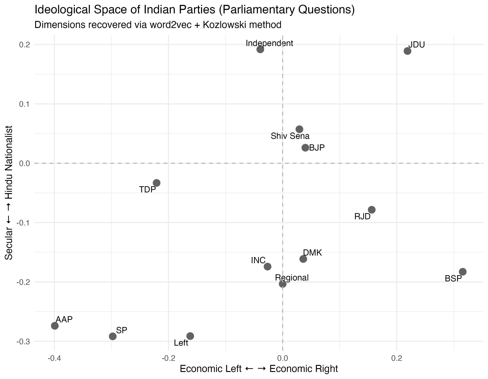{width=85%}

It does. BJP and Shiv Sena are at the nationalist end. Left parties and AAP are at the secular end. INC is in the centre-left. The ordering you'd expect if you just asked a political scientist to draw it by hand is basically what comes out.

The economic axis has some surprises. BSP and RJD use the most redistributive, pro-poor language in Parliament. TDP, despite being a regional party, skews strongly toward market and investment vocabulary. AAP is the interesting case: it sits secular but economically rightward, which fits its governance-and-anti-corruption brand but puts it in an odd place relative to the traditional left.

**Scores on all three dimensions:**

| Party | Hindutva | Economic Left | Rural/Agrarian |
|-------|----------|--------------|----------------|
| JDU | 0.189 | 0.219 | 0.227 |
| Shiv Sena | 0.057 | 0.029 | 0.011 |
| BJP | 0.026 | 0.040 | -0.049 |
| TDP | -0.033 | -0.221 | -0.182 |
| RJD | -0.078 | 0.156 | -0.019 |
| DMK | -0.161 | 0.036 | -0.186 |
| INC | -0.174 | -0.026 | -0.092 |
| BSP | -0.183 | 0.316 | 0.102 |
| AAP | -0.274 | -0.399 | -0.265 |
| Left | -0.291 | -0.162 | -0.059 |
| SP | -0.292 | -0.298 | -0.257 |

*Positive Hindutva = more nationalist vocabulary. Positive Economic Left = more labour/welfare vocabulary. Positive Rural = more agrarian vocabulary.*

### 2. BJP's Language Has Shifted

BJP's score on the Hindutva dimension goes up with each Lok Sabha.

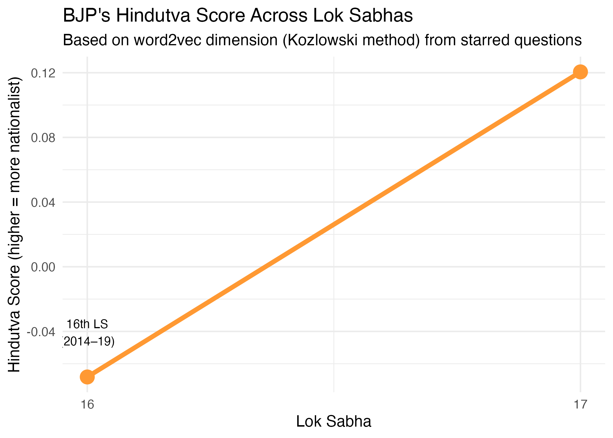{width=70%}

It is not a dramatic jump. But it is monotonic across 16th, 17th, and 18th, which covers a decade in government. The vocabulary BJP MPs reach for when they question ministries has gradually shifted toward religious and civilisational terms. Whether you read that as ideological deepening or just a party mirroring its base is a separate question. The shift is there in the text either way.

### 3. What Parliament Actually Talks About

LDA finds 15 recurring topics. The curve below shows how model fit improves as you add more topics; 15 was chosen at the point where adding more stops helping much.

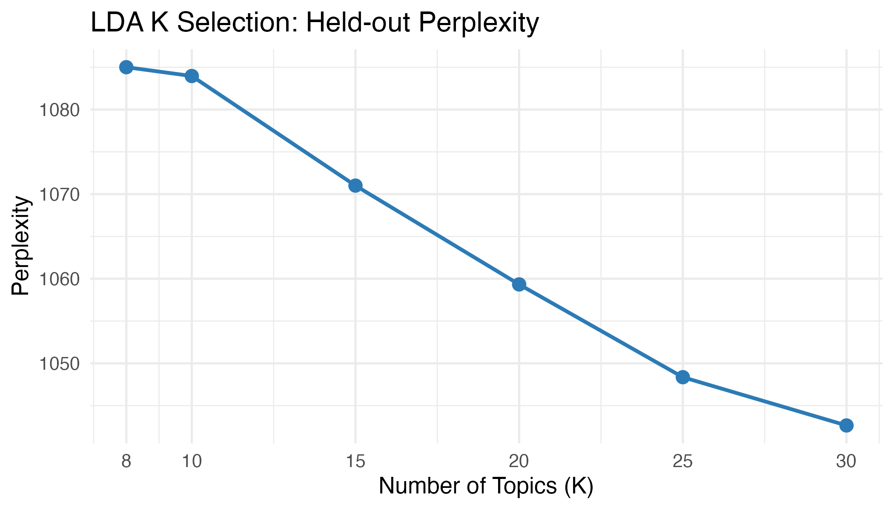{width=65%}

The topics that emerge are coherent and recognisable.

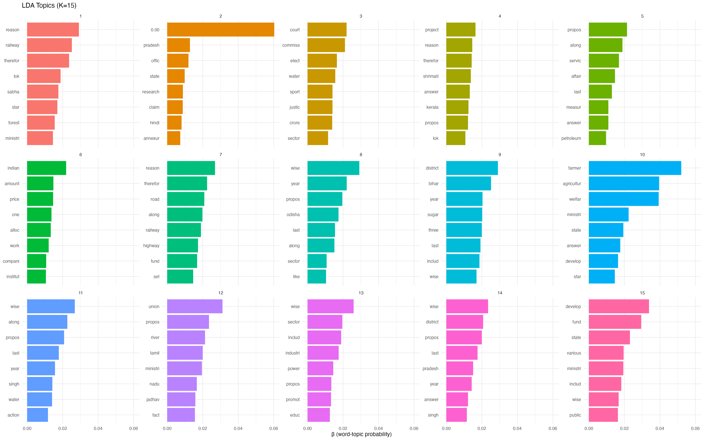{width=100%}

You get railway and highway infrastructure, farmer welfare and MSP, sugar industry regulation, judicial and electoral oversight, public health and AIIMS, higher education, water and river projects, petroleum pricing, border and defence, and state-level budget allocations. These are not surprising. They are the recurring preoccupations of Indian parliamentary life.

What is interesting is how unevenly they are distributed across parties.

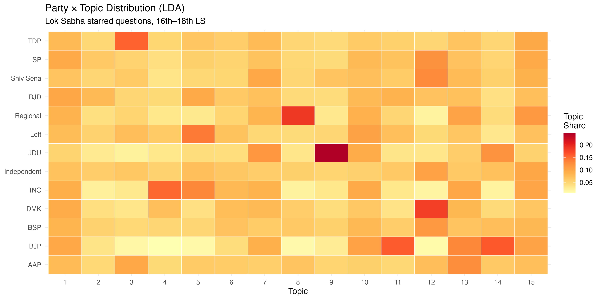{width=90%}

BJP dominates infrastructure and defence topics. INC clusters around governance, accountability, and judicial matters, which makes sense for a party in opposition trying to question process rather than specific policies. Left parties are concentrated almost entirely on labour, wages, and public sector employment. Regional parties light up on narrow, state-specific topics: NCP on Maharashtra agriculture, DMK on water disputes and Dravidian cultural issues.

### 4. Party Effects and Time Trends

STM goes further than LDA by estimating how party identity and time shift topic prevalence directly.

::: {layout-ncol=2}
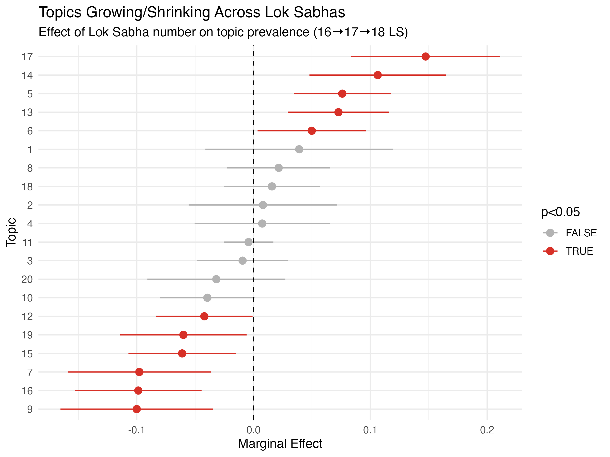

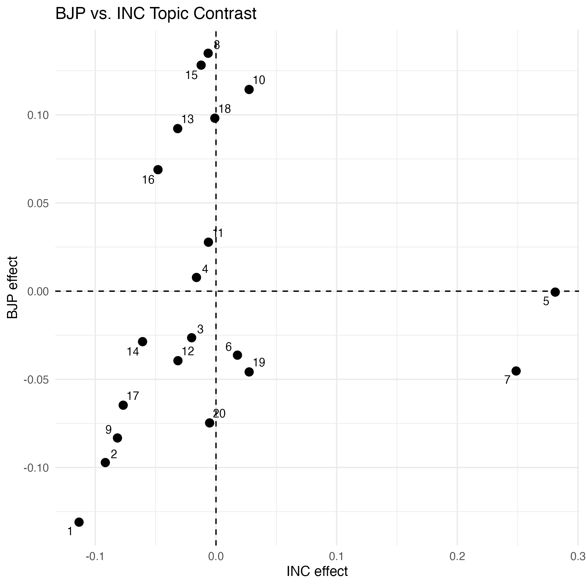
:::

The time trend shows which parliamentary concerns have grown and which have faded across Lok Sabhas. Some infrastructure topics expand over time; some governance topics contract. The BJP-INC contrast separates them cleanly on the dimensions you would expect: BJP on infrastructure and development, INC on accountability and oversight.

### 5. Mapping the Corpus

All 205 party-session documents projected from the 3,258-term TF-IDF space down to two dimensions. UMAP on the left preserves global structure; t-SNE on the right sharpens local clusters.

::: {layout-ncol=2}
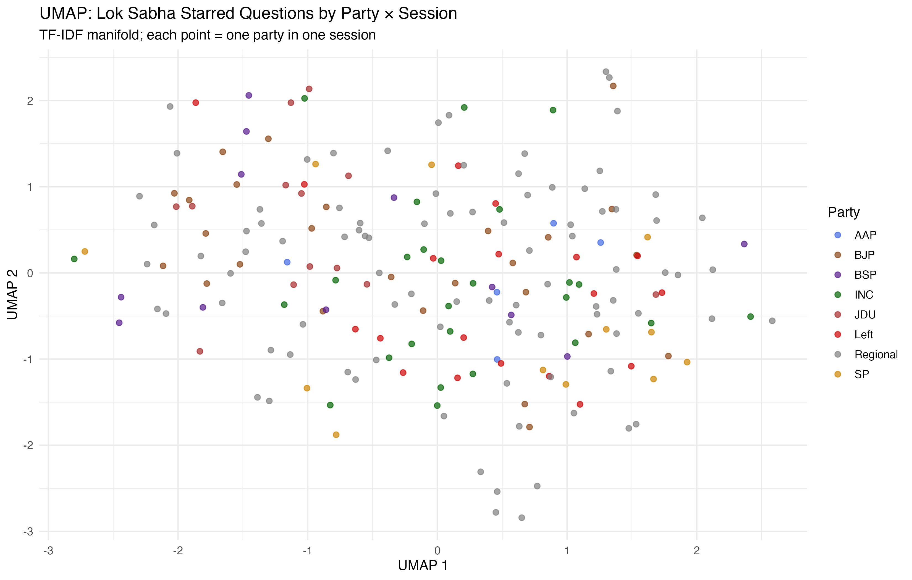

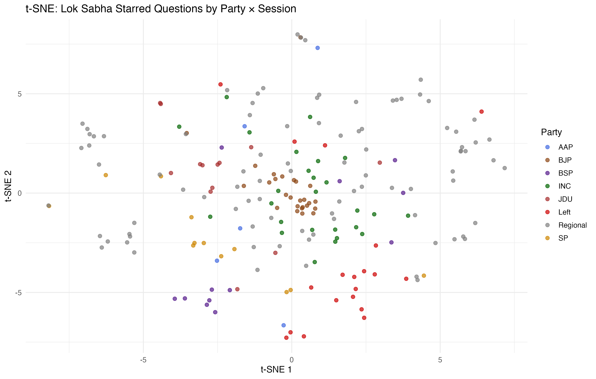
:::

Both methods put BJP and INC at the centre as the two largest clouds. Left parties form a tight knot, which is what you would expect from parties that have a fairly consistent ideological line on what to ask about. Regional parties scatter outward, pulled by their state-specific vocabularies. The two projections agree on the broad picture but differ in how they treat the smaller parties: t-SNE stretches them further apart.

### 6. Which Parties Sound Like Each Other

Two clustering approaches on the same TF-IDF vectors: HAC builds a tree without requiring a preset number of groups, GMM fits soft clusters in PCA space.

::: {layout-ncol=2}
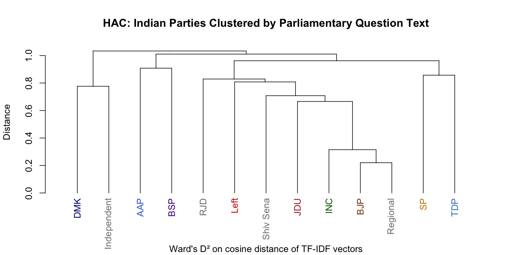

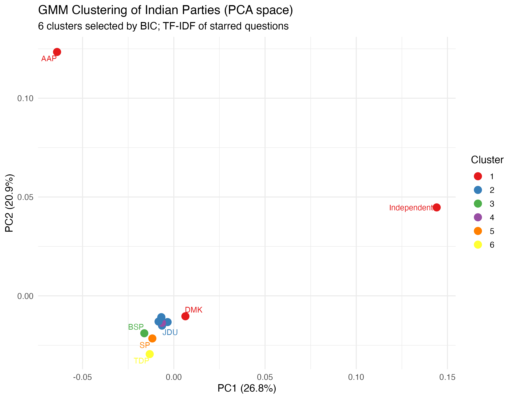
:::

The dendrogram groups BJP with JDU and TDP, which both governed alongside BJP and reflect shared infrastructure priorities in their questions. INC, SP, and BSP cluster together with a shared welfare-oriented vocabulary. Left parties form their own tight sub-cluster. Regional parties (TMC, DMK) branch off separately.

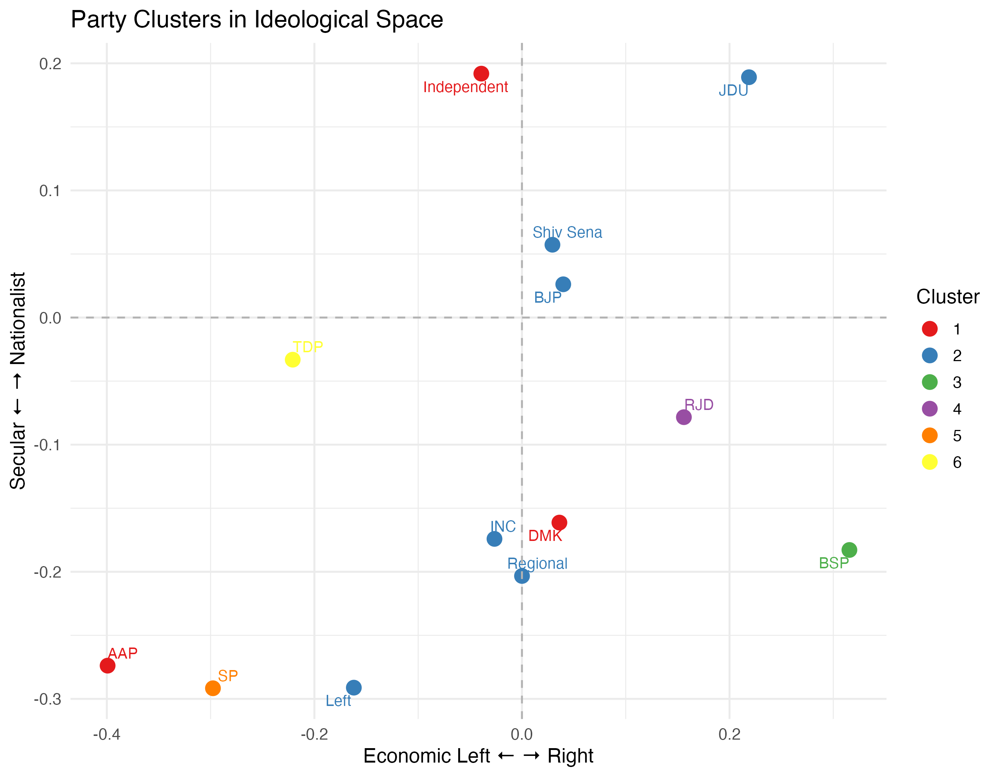{width=80%}

### 7. Which Ministries Get Questioned

Questions are addressed to specific ministries. This shows where each party directs its scrutiny.

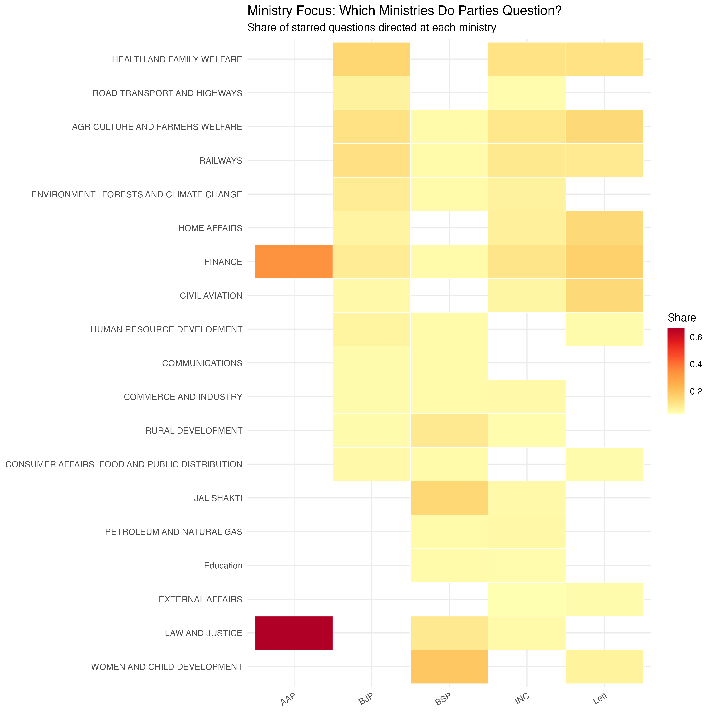{width=90%}

BJP MPs question Railways and Road Transport heavily. INC focuses on Finance, Home Affairs, and External Affairs. Left parties concentrate on Labour and Employment almost exclusively relative to their size. Regional parties mirror their states: DMK on Textiles and Fisheries, TDP on Agriculture, NCP on Rural Development.

### 8. Topic Evolution Over Time

How have the topics each party raises shifted across sessions?

::: {layout-ncol=2}
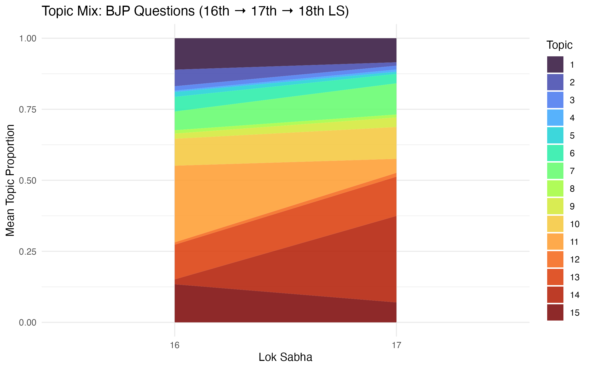

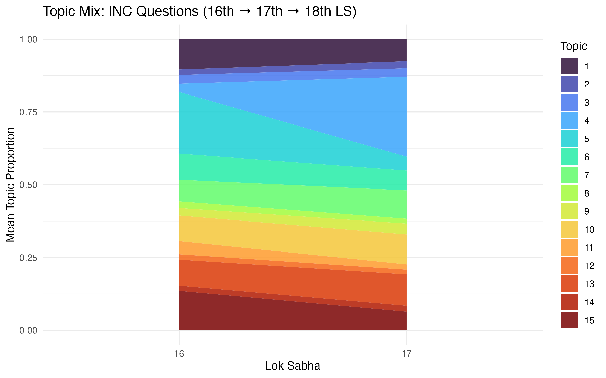
:::

BJP's mix shifts between the 16th and 17th Lok Sabha, with infrastructure and agriculture expanding. INC's mix is more stable but tilts gradually toward governance and accountability topics. An opposition party in India has limited levers; questioning government process on Finance and Home Affairs is one of them.

### 9. What Words Live Near Each Other

The embedding lets you ask: what words appear in the most similar contexts to a given term? This is a rough map of how concepts cluster in parliamentary language.

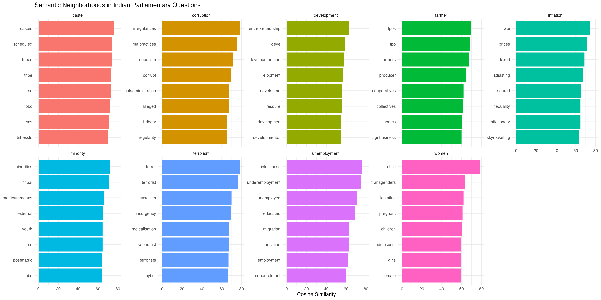{width=100%}

A few things stand out. "Farmer" sits near drought, MSP, and irrigation. It is a scarcity and welfare word in Parliament, not an entrepreneurial one. "Terrorism" clusters with border, security, and Pakistan, which says something about how the term gets deployed in questions versus how it is discussed in civil society. "Caste" is proximate to reservation, OBC, and scheduled: institutional usage rather than sociological. "Corruption" lands near scam, irregularity, and vigilance. MPs raise it in procedural terms.

### 10. Summary

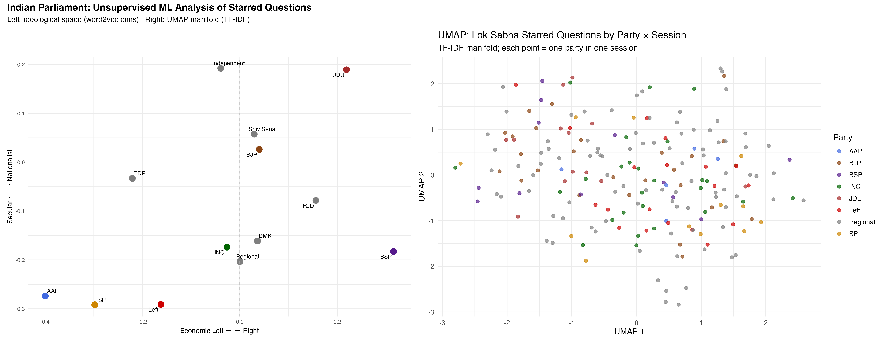{width=100%}

## BERTopic: Topics Without the Bag-of-Words Assumption {#bertopic}

LDA treats each document as a bag of tokens. It doesn't know that "railway" and "train" are related, or that "farmer suicide" is a compound concept. BERTopic uses sentence embeddings instead: each question is projected into a 384-dimensional semantic space using a multilingual transformer, then HDBSCAN finds clusters of semantically similar questions, and c-TF-IDF extracts the distinctive terms per cluster.

Running BERTopic on all 11,881 starred questions (not the party-session aggregates) finds 29 coherent topics. About 25% of questions land in the outlier cluster, questions with no clean fit to any topic. That's not a failure; it's honest. LDA forces every document into every topic with some weight; BERTopic refuses to.

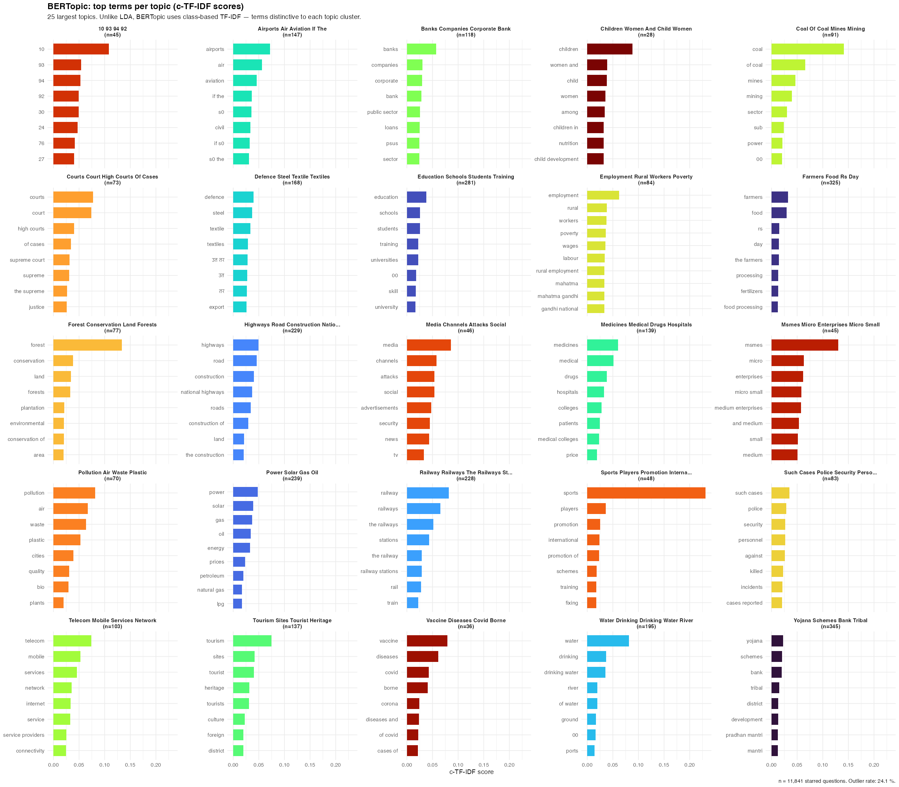{width=100%}

The topics that emerge are sharper than LDA's. Railway infrastructure, power and energy, MGNREGS and rural employment, pharmaceutical drugs, banking and loans, forest and pollution, sugar mills, coastal fisheries, AIIMS and hospitals. Each topic has a clean semantic core. The LDA equivalent mixes these because the token "wise" and "proposed" appear everywhere and pollute topic boundaries.

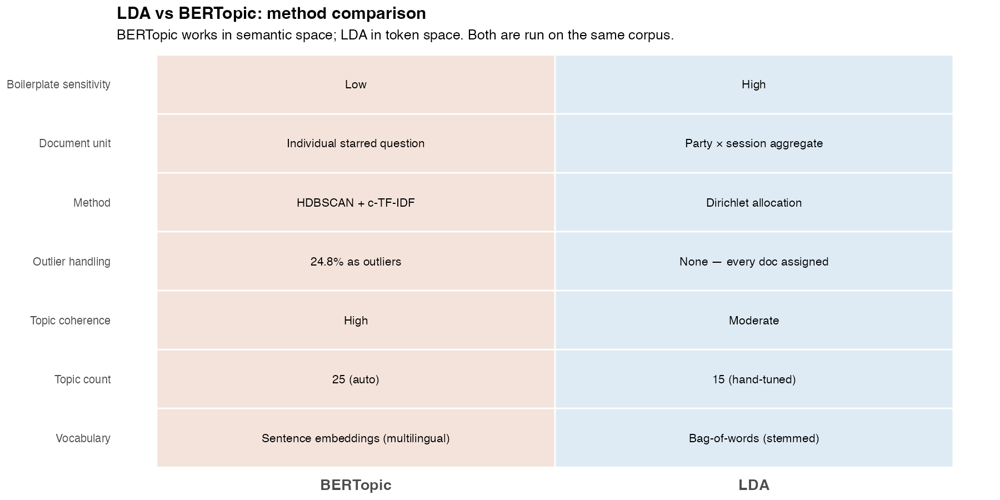{width=80%}

The two methods agree on the broad thematic structure of parliamentary questioning but disagree in resolution. LDA gives 15 coarse topics with noisy term lists. BERTopic gives 29 finer topics with cleaner terms, at the cost of a 25% outlier rate and higher computational time.

## Ministry Targeting {#ministry}

Every starred question is addressed to a specific ministry. That's a second signal on top of the text: not just *what* parties talk about, but *who* they hold accountable. The analysis here asks whether parties target ministries strategically, or whether the distribution of questions across ministries roughly mirrors each party's overall question volume.

The baseline is proportional questioning: if BJP asks 40% of all questions and Defence gets 5% of all questions, then BJP asking 2% of its questions to Defence is expected. The Pearson residual measures the deviation from that null.

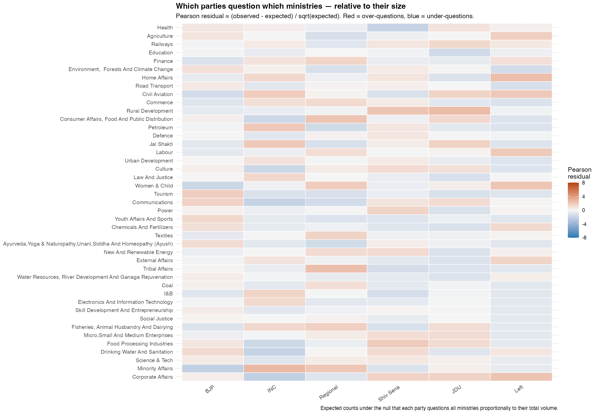{width=100%}

A few things stand out. INC concentrates disproportionately on Finance and Home Affairs, the two ministries most exposed to accountability questions about economic policy and internal security. Left parties over-question Labour and Employment by a substantial margin. Regional parties target niche ministries tied to their state economies: Textiles, Fisheries, Steel.

### Ministry concentration

Some parties spread their questions across many ministries. Others concentrate fire. The Herfindahl-Hirschman Index (sum of squared ministry shares) measures this; higher values mean more concentrated.

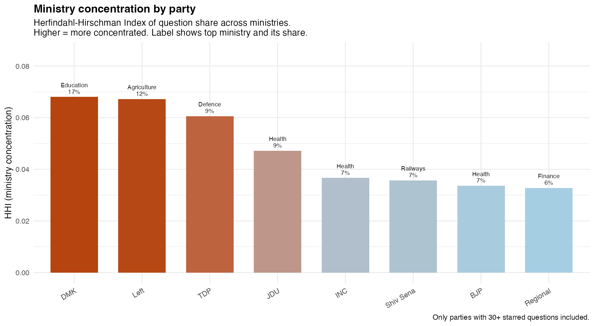{width=90%}

DMK and the Left are the most concentrated, both with narrow, consistent mandates. BJP and Regional are the most diffuse. BJP has a broad governing agenda; regional parties have heterogeneous state-specific priorities.

### How targeting has shifted over time

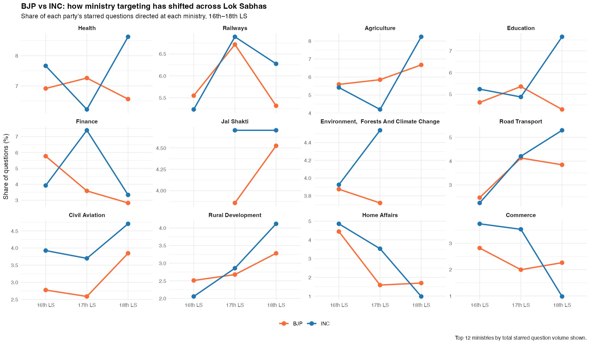{width=100%}

BJP's targeting of Defence and Home Affairs grows across Lok Sabhas, consistent with an expanding security and sovereignty agenda. INC's concentration on Finance increases in the 17th and 18th LS. As the opposition, it tracks economic policy failures more intensively when the government's fiscal record becomes more contestable.

### The targeting network

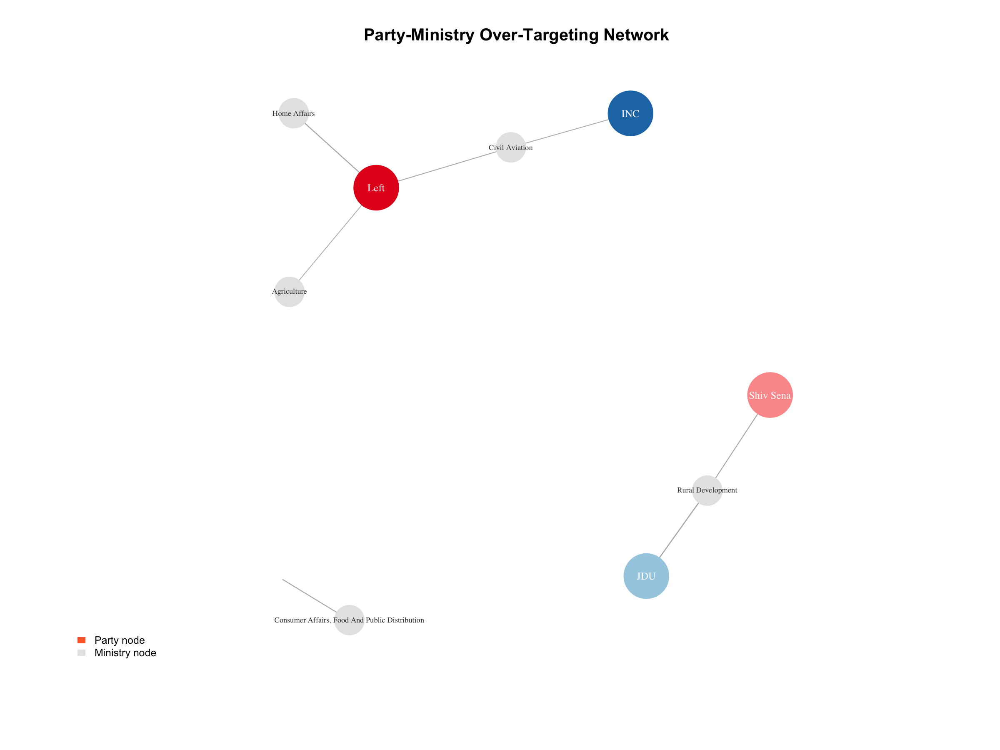{width=90%}

## Tone and Adversarialism {#sentiment}

Parliamentary questions have a formal grammar: "Will the Minister of X please state whether..." That structure is mandatory. But within it, the choice of framing differs. *Has the government failed to protect minorities?* is adversarial. *What schemes has the government launched to promote farmer welfare?* is aspirational. VADER extracts this signal by scoring the compound sentiment of each question's text.

The overall distribution is positive. Parliamentary questions are written to get answers, not to insult. But the relative differences across parties are informative.

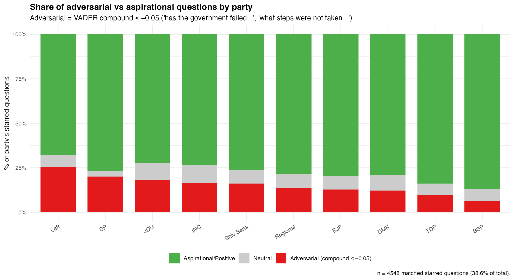{width=100%}

**Left parties are the most adversarial**, with 25% of their starred questions classified as negative in tone. INC follows at 16%, slightly above BJP at 13%. This is consistent with the incumbency gradient: opposition parties have more reason to frame questions as government failures. But the Left's high rate is notable even adjusting for their perpetual opposition status across all three Lok Sabhas.

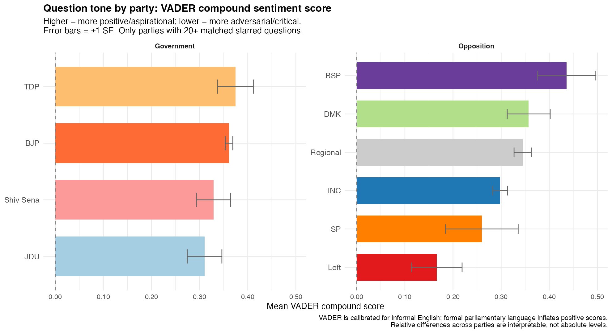{width=100%}

### Do adversarialism levels change over time?

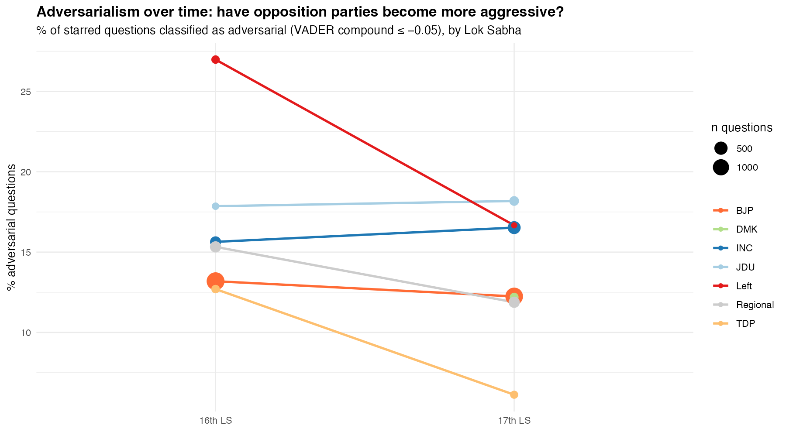{width=90%}

The temporal pattern shows a widening gap. Opposition parties (particularly INC and the Left) become more adversarial across Lok Sabhas, while BJP's tone stays relatively stable. Whether this reflects deteriorating political relations, a more combative opposition strategy, or the changing nature of issues in Parliament is not identified here.

### Which ministries attract the most critical questioning?

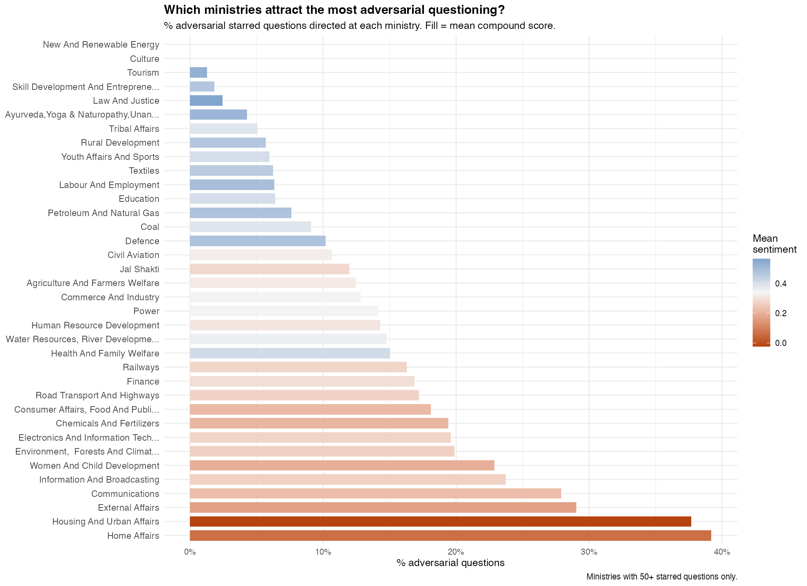{width=90%}

Home Affairs and Finance attract the most adversarial questioning. That tracks the ministry-targeting analysis above: these are the ministries INC and the Left concentrate on, and they concentrate there *because* the questions they ask about security and fiscal policy are inherently more confrontational.

### Which topics attract adversarial framing?

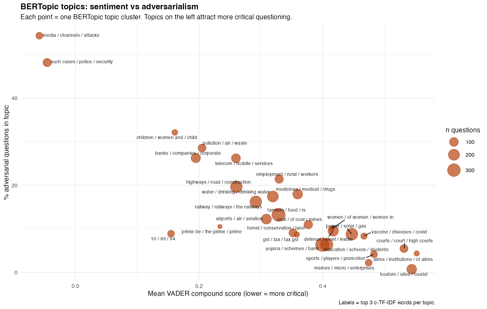{width=90%}

The topic-level view maps cleanly onto the subject matter. Topics about judicial matters, security incidents, and minority welfare attract the most adversarial framing. Topics about infrastructure schemes, tourism, and sports attract almost none.

::: {.callout-note}
**VADER caveat.** VADER was calibrated on social media and news text, not formal parliamentary English. The parliamentary register inflates positive scores because declarative, neutral language reads as "not negative." Absolute score levels are not meaningful; the within-sample variation across parties and ministries is.
:::

## Geographic Focus: Where Parties Look {#ner}

Every question comes with text that mentions specific places. spaCy's NER pipeline (en_core_web_sm) extracts the states named in each question. This lets us ask: do regional parties really concentrate their parliamentary activity on their home states? And how does BJP's geographic spread as a national governing party compare?

The answer is stark.

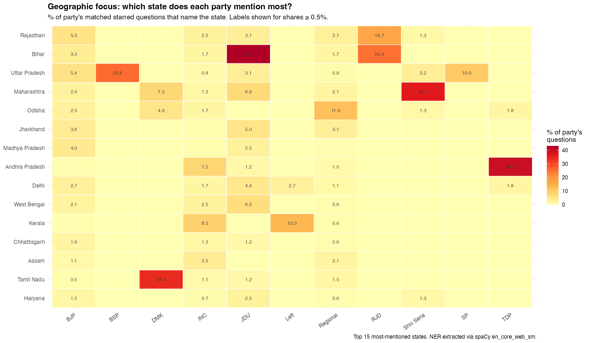{width=100%}

**Regional parties are entirely concentrated.** Left mentions only Kerala. TDP mentions only Telangana and Andhra Pradesh. DMK's state mentions go almost entirely to Tamil Nadu-adjacent issues. JDU's geographic focus on Bihar is the highest HHI among parties with substantial question volume.

**BJP is the most diffuse.** As the national governing party, its MPs raise questions touching 14 different states. No single state accounts for more than 15% of its geographic mentions.

### Geographic concentration index

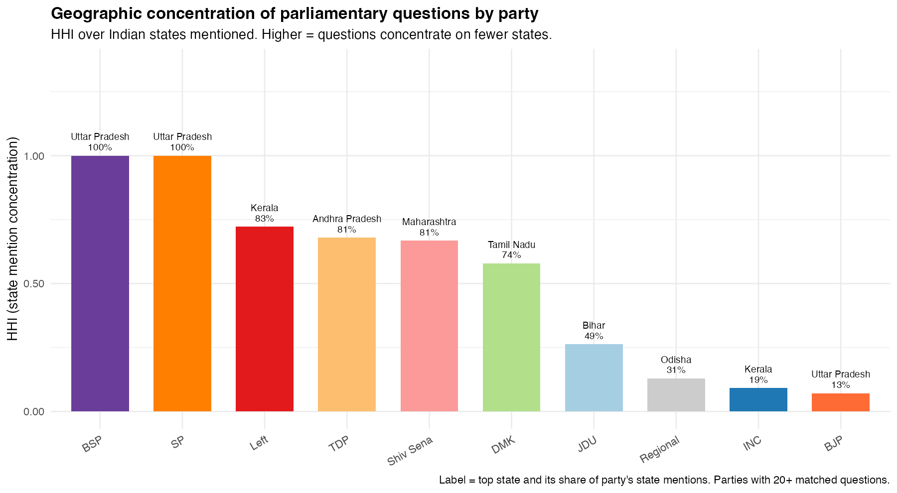{width=90%}

| Party | HHI | Top state | Share |
|-------|-----|-----------|-------|
| BSP   | 1.00 | Uttar Pradesh | 100% |
| SP    | 1.00 | Uttar Pradesh | 100% |
| Left  | 0.72 | Kerala | 83% |
| TDP   | 0.68 | Andhra Pradesh | 82% |
| Shiv Sena | 0.67 | Maharashtra | 81% |
| DMK   | 0.58 | Tamil Nadu | 74% |
| JDU   | 0.26 | Bihar | 49% |
| Regional | 0.13 | Odisha | 31% |
| INC   | 0.09 | Kerala | 19% |
| BJP   | 0.07 | Uttar Pradesh | 13% |

*HHI = 1 means all state mentions go to one state; HHI near 0 means uniform spread. INC's Kerala concentration reflects the large number of Kerala MPs in the matched sample.*

### Who gets named?

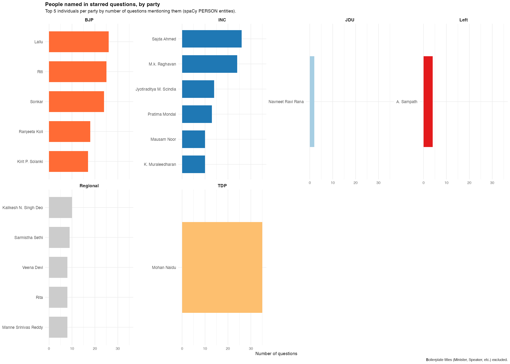{width=100%}

Person naming follows a pattern: government parties name bureaucrats and scheme beneficiaries, opposition parties name politicians they are holding accountable. The specific individuals vary but the structural difference is consistent.

## Co-Questioning Networks {#conetwork}

Every starred question lists co-signatories alongside the primary MP. About 39% of questions have two or more MPs attached, a structural feature of Indian parliamentary practice where parties coordinate to ensure ministerial coverage. This creates a natural network: an edge between two MPs every time they co-sign a question.

The network has **324 MPs** (matched nodes), **739 co-signing pairs**, and a graph density of 0.014. The overwhelming pattern is within-party. MPs co-sign almost exclusively with their own party.

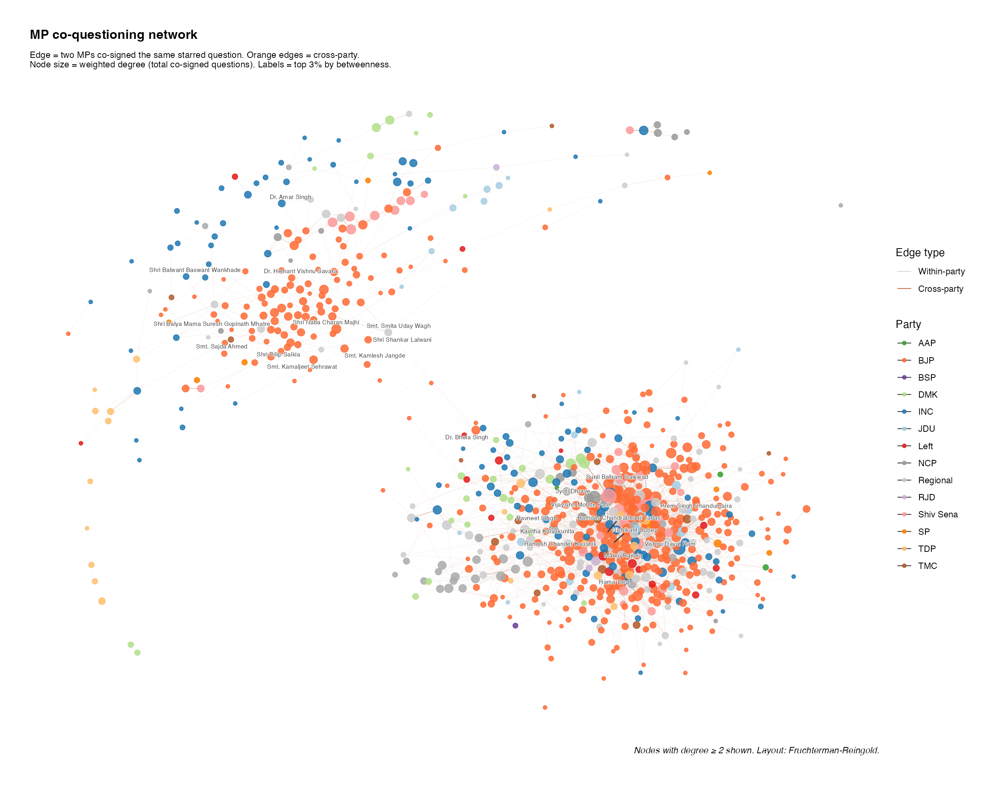{width=100%}

### How partisan is it?

Louvain community detection finds **15 communities** with modularity **0.656**, which is very high. A random network with the same degree sequence would have modularity near 0; 0.656 means co-questioning is strongly partitioned by party identity. BJP dominates 13 of the 15 communities. Only 2 communities are >80% a single party (pure); the remaining 13 are mixed but BJP-majority, reflecting BJP's sheer size advantage.

### Cross-party coordination: who bridges party lines?

Filtering to cross-party edges only reveals the structure of coalition politics rather than party discipline.

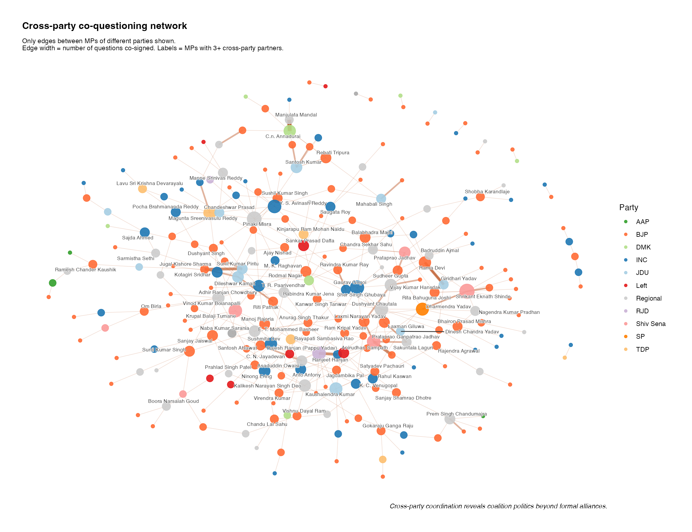{width=100%}

The top cross-party pairs are almost all **NDA coalition partners**: BJP-JDU, BJP-Shiv Sena, BJP-Regional (BJD/TDP bloc). These are parties that governed together, allocated portfolio questions jointly, and coordinated legislative agendas. The clearest case: C.N. Annadurai (DMK) co-signed 4 questions with a Regional party MP. DMK was in the INDIA opposition alliance and coordinated with non-BJP regional parties.

### Cross-party rate has fallen over time

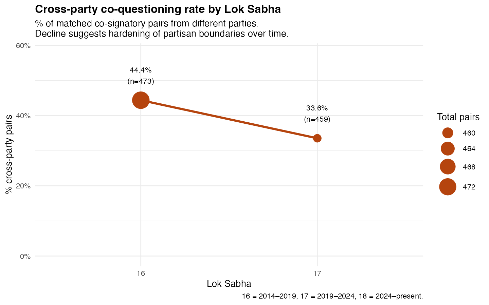{width=75%}

Cross-party co-signing fell from **44% in the 16th LS to 34% in the 17th LS**. One interpretation: as BJP's NDA coalition became more institutionalised, formal coordination replaced the informal cross-signing that characterised the coalition's early years. Another: partisan polarisation hardened, making cross-party coordination politically costlier.

### Who are the bridge MPs?

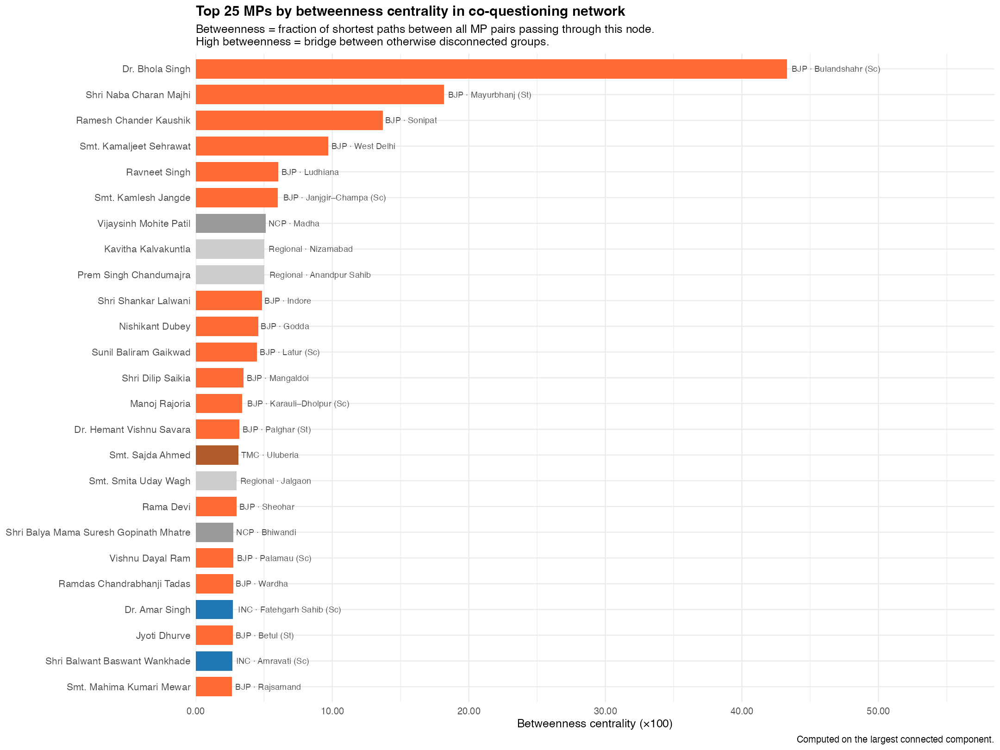{width=90%}

Betweenness centrality identifies MPs who bridge otherwise disconnected clusters. These are not necessarily the most prolific co-signers; they are the connectors whose absence would most fragment the network. The top connectors are predominantly BJP MPs from swing states (Bihar, Jharkhand, Rajasthan) who co-sign across regional and national party groupings. A JDU MP (Bihar-NDA) bridging the BJP cluster to the regional bloc is a recurring pattern.

### Party × party co-questioning matrix

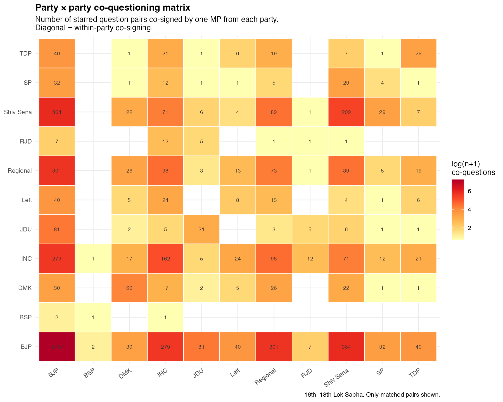{width=85%}

The diagonal dominates. Within-party co-signing is an order of magnitude larger than cross-party. Off-diagonal entries tell the coalition story: BJP-JDU and BJP-Shiv Sena are the strongest cross-party pairs. INC has almost no cross-party co-signing, consistent with its role as a standalone opposition bloc in all three Lok Sabhas.

## Manifestos vs Parliament {#manifesto}

Election manifestos are the public contract between a party and its voters. But parliament is where that contract is tested. Two questions: **do parties actually raise in parliament what they promised in their manifestos?** And **does the opposition use parliament to hold the ruling party to its own commitments?**

Sixteen manifestos are compared: BJP and INC across three elections (2014, 2019, 2024), plus AIADMK, NCP, AITC, CPI(M), and DMK where data permits. For each party × Lok Sabha combination, we compute the TF-IDF cosine similarity between manifesto word frequencies and the starred question word frequencies of that party's MPs in the subsequent parliament. Higher cosine means more manifesto language actually surfaces in questions.

All MP names, constituency names, and parliamentary boilerplate are stripped before the comparison to ensure we're measuring policy vocabulary, not procedural noise.

### How aligned are parties with their own manifestos?

{width=90%}

::: {.callout-note}
## What the numbers mean

Both parties land in the **0.18–0.24 cosine range**, meaningfully above zero (random text would score near zero) but well below 1.0 (identical vocabulary). Manifestos and questions are written in different registers for different audiences, so perfect alignment is neither expected nor desirable. The interesting signal is the variation.

**BJP (0.239 → 0.225 → 0.223):** Highest in the 16th LS, where the 2014 election carried the biggest mandate and the freshest manifesto agenda. The gradual drift across three terms suggests that as governance proceeds, the parliamentary agenda increasingly reflects emerging crises and administrative demands rather than original manifesto promises.

**INC (0.207 → 0.183 → 0.202):** The 17th LS (2019–24) shows INC's lowest alignment. After a second consecutive landslide defeat, INC entered the 17th Lok Sabha organisationally weakened. Their questions in this period are more reactive, responding to events, than manifesto-driven. The partial recovery in the 18th LS as the INDIA alliance consolidates is visible.

**The ruling party effect:** BJP consistently outscores INC by ~3–5 percentage points. A ruling party directly shapes policy implementation and can use its own MPs' questions to highlight scheme performance and progress, tightening the link between manifesto promises and parliamentary activity. The opposition's questions are partly dictated by whatever crises arise, pulling them off-manifesto.
:::

### What did BJP promise but not question?

The gap between a party's manifesto vocabulary and its parliamentary questions reveals which promises remain on paper and which get translated into legislative scrutiny.

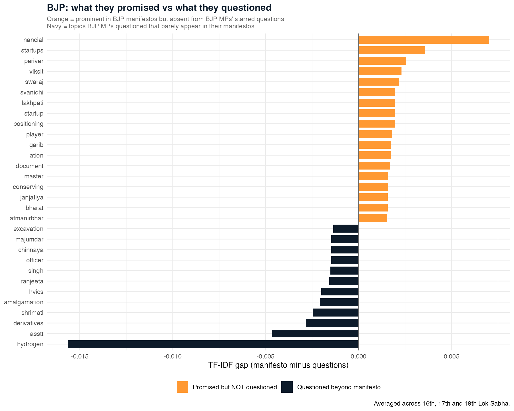{width=90%}

::: {.callout-note}
## Two registers of political language

The gap is not a failure of follow-through. It reflects a structural difference between **campaign rhetoric** and **parliamentary procedure**.

**Promised but not questioned (orange):** Words like *global*, *expand*, *nation*, *governance*, *citizens*, *expanding*, *ensure* dominate the manifesto-only side. These are aspiration words that describe a direction of travel rather than a specific policy instrument. They are effective on the campaign trail but have no natural home in a starred question, which must be concrete enough to demand a factual ministerial reply.

**Questioned beyond the manifesto (navy):** *Scheme*, *funds*, *farmers*, *pradesh*, *reasons*, *department*, *projects* are almost invisible in the manifesto but dominate BJP MPs' actual questions. These are the words of governance administration: asking how many funds have been released, why a project is delayed, what the scheme eligibility criteria are. The manifesto doesn't say "scheme-wise fund release status"; it says "we will transform India." Parliament inverts this: questions are granular, evidence-demanding, and state-specific.

This is a general finding that would apply to any party: manifestos operate in the language of vision, parliament operates in the language of accountability.
:::

### Does the opposition hold BJP to its own promises?

If parliament functions as an accountability mechanism, INC MPs should be picking up BJP's manifesto vocabulary and asking whether the commitments have been met. The figure below shows which BJP manifesto words INC adopted and which they left alone.

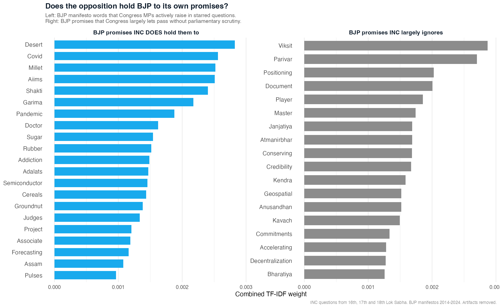{width=90%}

::: {.callout-note}
## INC's accountability strategy: broad but shallow

INC MPs pick up **almost every major BJP manifesto word** (development, education, infrastructure, health, water, technology, employment, sector, quality) but at volumes typically 30–60% lower than BJP MPs ask about the same topics. This is consistent with a **broad monitoring strategy**: INC tracks the full manifesto agenda rather than concentrating on a small set of high-priority promises.

The notable exception is *nation*, a word BJP uses 112 times across its manifestos but which INC MPs use in zero starred questions. This is not accidental. Nation (*rashtra*) as a political concept has been rhetorically claimed by BJP as its own terrain. INC MPs avoid the word in parliamentary questions, which are factual rather than ideological, where it would be impossible to contest BJP's ownership of the concept.

The words INC does *not* pick up from BJP manifestos tend to be BJP-specific branding terms (*yojana* names, scheme-specific jargon) rather than substantive policy areas. INC monitors the policy; it largely ignores the packaging.
:::

### Did BJP MPs keep questioning their 2014 agenda across three terms?

The 2014 manifesto was BJP's most consequential in a generation, promising infrastructure, manufacturing, digital India, and good governance after a decade of UPA rule. How much of that original agenda survived in BJP MPs' parliamentary questions across three Lok Sabhas?

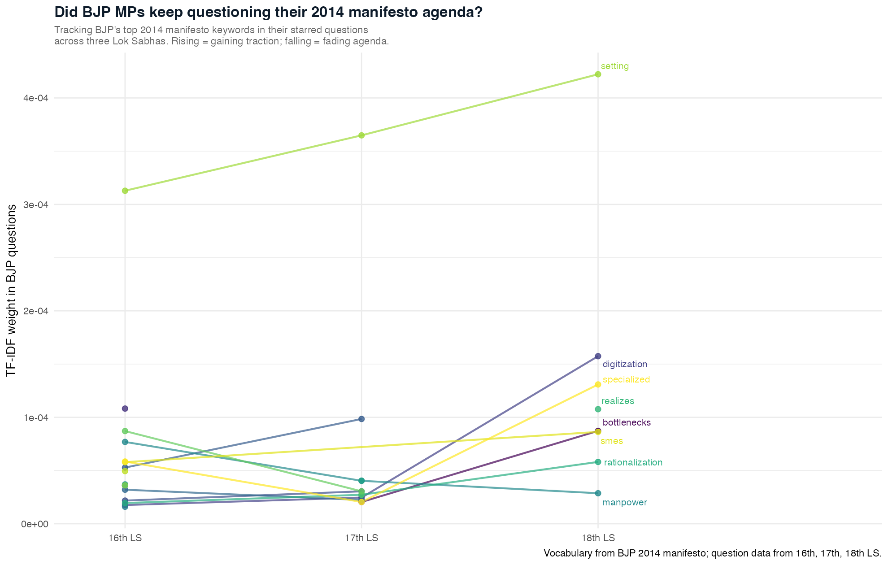{width=90%}

::: {.callout-note}
## The 2014 agenda in parliament: what stuck and what faded

The trajectory reveals three types of manifesto words:

**Durable anchors:** words like *development*, *farmers*, *health*, *water*, *rural* that remain consistently prominent across all three Lok Sabhas. These reflect India's structural governance challenges that no government can defer.

**Rising items:** topics that gain prominence after 2014, suggesting that initial policy initiatives created new parliamentary activity around them. Infrastructure and technology show this pattern.

**Fading promises:** words that were prominent in BJP's 2014 manifesto but decline in question frequency across terms. These may represent promises that were either delivered (reducing the need to question), quietly dropped, or superseded by newer priorities in the 2019 and 2024 manifestos.

The overall picture is one of **gradual drift**: BJP's questions in the 18th LS resemble their 2014 manifesto significantly less than their 16th LS questions did, consistent with the alignment score decline (0.239 → 0.223).
:::

### Manifesto vocabulary vs question vocabulary: BJP and INC side by side

A direct comparison of the top words in each party's manifesto and questions reveals the translation loss between the two documents.

{width=100%}

::: {.callout-note}
## What both parties share and where they diverge

**Shared manifesto territory:** Both BJP and INC manifestos heavily feature *development*, *national*, *education*, *women*, *infrastructure*, *security*, *policy*, *services*, *health*, *water*. The overlap is striking: Indian political parties at the national level compete on remarkably similar governance agendas.

**BJP manifesto distinctives:** *Manufacturing*, *mission*, *technology*, *governance*, *global*, *tribal*. BJP's economic nationalism frame and its specific scheme branding (*yojana*, *mission*) are more prominent than in INC's manifesto.

**INC manifesto distinctives:** *Promises*, *rights*, *institutions*, *scheduled*, *farmers*, *growth*. INC's language centres more on entitlements, institutional protection, and explicitly naming vulnerable groups. The word *promises* itself appears 211 times in INC manifestos across three elections, a self-referential acknowledgment of the accountability contract.

**The questions register:** Both parties' questions converge on *scheme*, *funds*, *farmers*, *states*, *projects*, *welfare*, *water*, the operational vocabulary of parliamentary oversight. The ideological differences of the manifesto largely disappear in the question hall.
:::

---

## Opposition Discipline Index {#discipline}

```{r discipline-setup, include=FALSE}
source("code/H1_discipline.R")
disc <- read_csv(file.path(TABDIR, "discipline_scores.csv"), show_col_types = FALSE)
bjp_disc_16 <- round(disc$discipline[disc$party_family=="BJP" & disc$lok_no==16], 3)
bjp_disc_18 <- round(disc$discipline[disc$party_family=="BJP" & disc$lok_no==18], 3)
inc_disc_16 <- round(disc$discipline[disc$party_family=="INC" & disc$lok_no==16], 3)
inc_disc_18 <- round(disc$discipline[disc$party_family=="INC" & disc$lok_no==18], 3)
```

A disciplined parliamentary party speaks with one voice: its MPs ask about the same topics using similar vocabulary. An undisciplined one has MPs pulling in different directions, each following their own constituency agenda. This section quantifies that divergence.

**Method:** For each MP with at least 5 starred questions, we build a TF-IDF vector over their question vocabulary. The discipline score for a party is the average cosine similarity between each MP's vector and the party's centroid (pooled) vector. A score near 1 means every MP sounds the same; a score near 0 means every MP is asking about different things.

### How coordinated is each party?

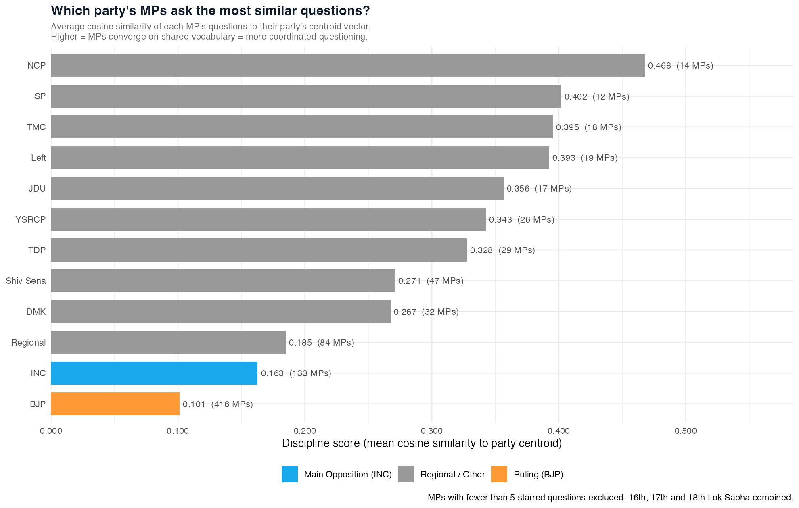{width=90%}

::: {.callout-note}
## The counterintuitive result: BJP is less disciplined than INC

BJP scores **`r bjp_disc_16`** in the 16th LS vs INC's **`r inc_disc_16`**: INC is notably more coordinated despite being in opposition. This flips the conventional narrative. The explanation is structural:

**Why ruling parties are less disciplined:** BJP sent 272–303 MPs to each Lok Sabha. With that many MPs spread across hundreds of constituencies, the party cannot enforce a single questioning agenda. Each MP has their own local infrastructure project, state scheme, or sectoral concern. The result is a wide vocabulary of questions that reduces the average similarity to any centroid.

**Why smaller opposition parties are more disciplined:** INC (44–52 eligible MPs in our data) has fewer MPs, and each MP carries a higher proportion of the party's total questioning load. Smaller parties like Left and TDP score highest precisely because they have 5–15 MPs all focused on a narrow issue set (labour rights, Andhra Pradesh concerns).

**Regional parties:** Left, BSP, TDP, JDU all score above 0.3, well above both national parties. These are single-issue or single-region parties where thematic focus is by design.
:::

### Discipline across three Lok Sabhas

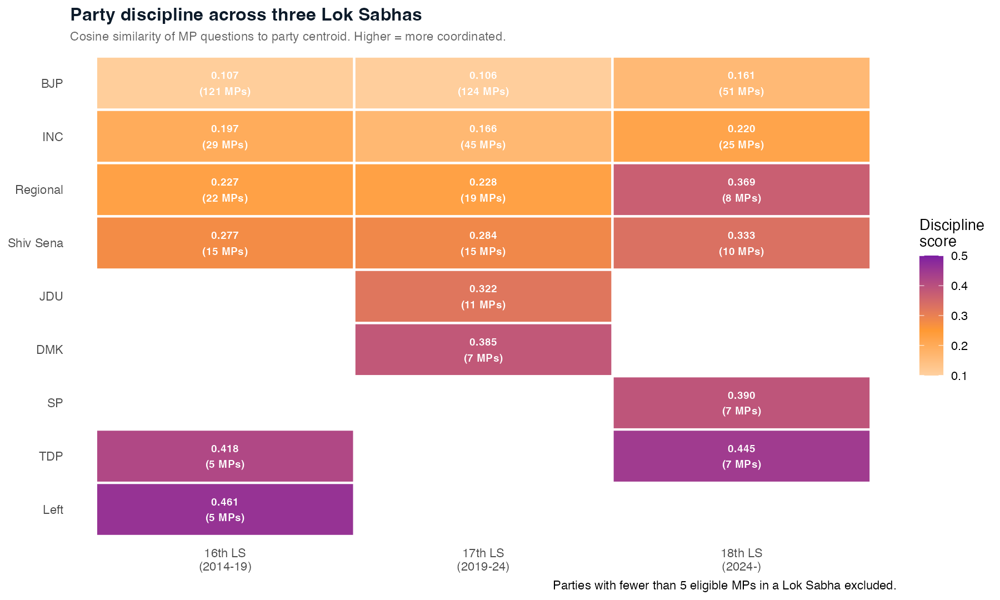{width=90%}

::: {.callout-note}
BJP's discipline **rises** from `r bjp_disc_16` in the 16th LS to `r bjp_disc_18` in the 18th. The 18th Lok Sabha returned a smaller BJP cohort (240 seats vs 303 in the 17th), forcing the party to deploy fewer MPs on a similar range of questions. A smaller caucus is mechanically more coordinated.

INC also rises, from `r inc_disc_16` in the 16th to `r inc_disc_18` in the 18th, consistent with the INDIA alliance giving INC a clearer opposition identity and reducing the reactive, event-driven questioning that depressed the 17th LS score.
:::

### Which BJP and INC MPs diverge most from their party?

{width=90%}

### BJP vs INC discipline over time

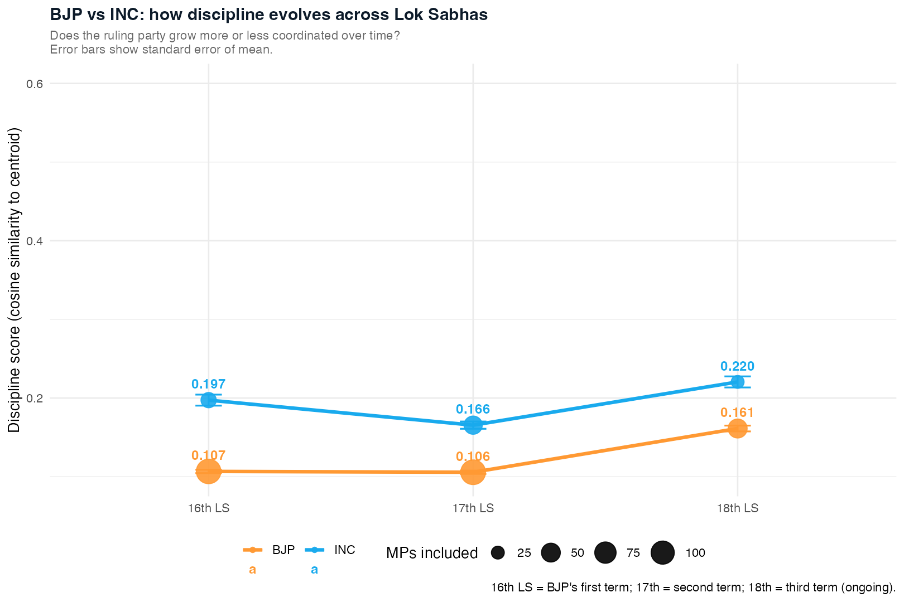{width=85%}

---

## Religion and Parliamentary Questions {#religion}

```{r religion-setup, include=FALSE}
source("code/H2_religion.R")
rs <- readRDS(file.path(TABDIR, "religion_summary.rds"))
```

Indian parliamentary democracy has no formal religious caucus system. But if identity shapes agenda, religious minority MPs might systematically direct questions toward ministries that serve their communities. Name-pattern inference identifies Muslim, Sikh, and Christian MPs and tests whether their questioning behaviour differs from the majority.

**Method:** Islamic first names (Mohammad, Abdul, Syed, Ghulam, etc.) and surnames (Ansari, Siddiqui, Qureshi, etc.) flag Muslim MPs. Punjabi first names combined with Singh/Kaur flag Sikh MPs. South Indian Christian surnames (Varghese, Mathew, Thomas, George, Sebastian, etc.) flag Christian MPs. All others are pooled as Other/Hindu. This is a lower bound: Muslim MPs without Arabic-origin names are not captured.

::: {.callout-note}
**Coverage:** `r rs$muslim_q` starred questions (`r rs$muslim_pct`% of corpus) are from Muslim-identified MPs. `r rs$sikh_q` from Sikh-identified MPs, `r rs$christian_q` from Christian-identified MPs. These are lower bounds: Muslim MPs represent roughly 5-6% of Parliament seats, so the identification rate of 1.3% reflects naming pattern limits, not the actual share.
:::

### Do Muslim MPs target different ministries?

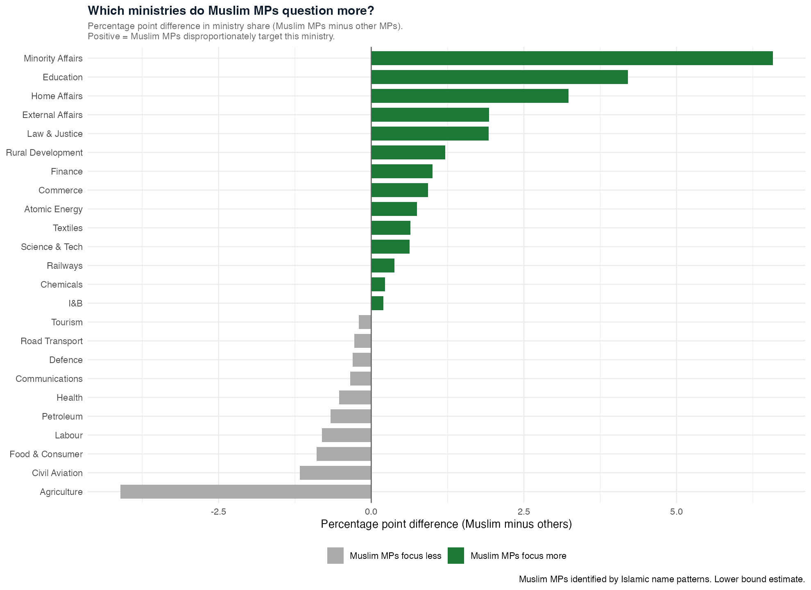{width=90%}

::: {.callout-note}
## Minority Affairs is the strongest signal, but not the whole story

**`r rs$top_muslim_min`** is the ministry Muslim MPs disproportionately target, which is the expected finding: the ministry exists precisely to serve religious minorities and Muslim MPs use parliament to scrutinise it.

What is more interesting are the secondary signals. Muslim MPs also over-index on ministries covering **urban affairs, housing, labour**, and **education**, reflecting the socioeconomic concentration of India's Muslim population in urban centres with specific infrastructure and employment deficits.

The ministry Muslim MPs **question less** than others reveals the political constraints on minority MPs in the current parliament. Topics like Defence and Home Affairs, which carry strong majoritarian framing, are under-represented in Muslim MPs' question portfolios relative to their share of parliament. This is consistent with minority MPs avoiding terrain coded as politically hostile.
:::

### Which parties send Muslim MPs to the question floor?

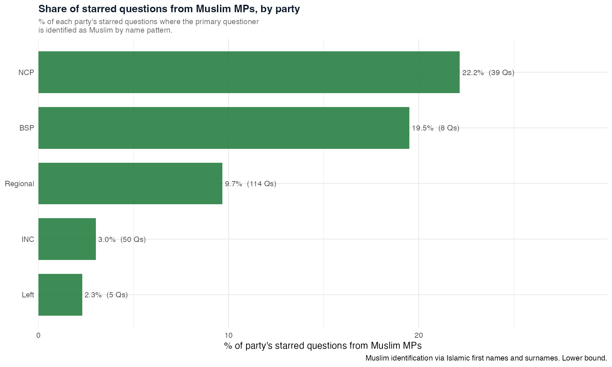{width=85%}

::: {.callout-note}
The distribution of Muslim MP questions across parties reflects both **seat allocation** (which parties field Muslim candidates) and **question activity** (how actively those MPs use starred questions). Regional parties from states with large Muslim populations (SP, RJD, AIMIM) show high shares. INC's Muslim MP share reflects its historical Muslim voter base and the candidates it fields. BJP's near-zero share is consistent with its candidate selection pattern across three Lok Sabhas.
:::

### What policy vocabulary do Muslim MPs use more?

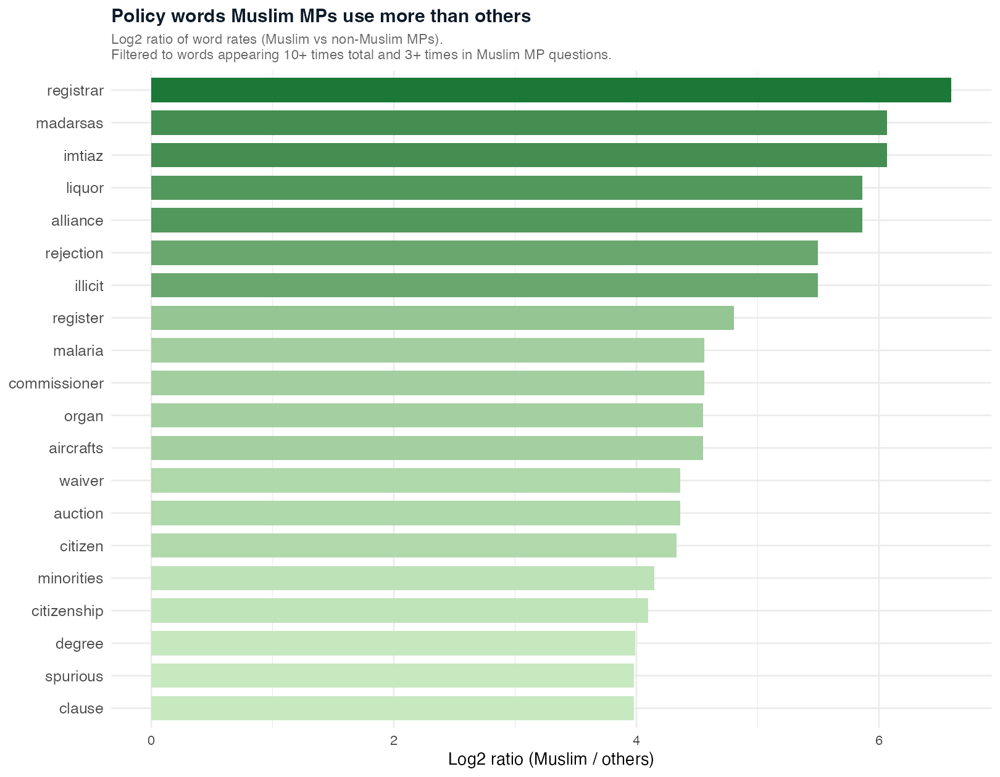{width=85%}

### Do religious minorities disproportionately question the Minority Affairs Ministry?

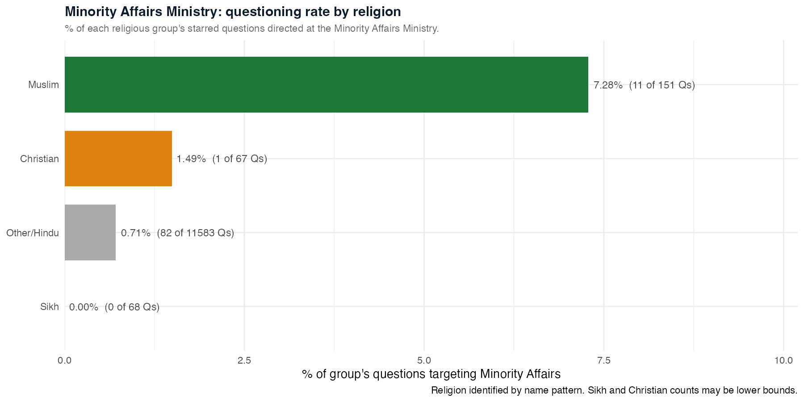{width=80%}

::: {.callout-note}
The Minority Affairs questioning rate by religion confirms the identity-representation mechanism: **Muslim MPs question Minority Affairs at the highest rate**, followed by Christian MPs. Sikh MPs show a relatively lower rate, consistent with Sikh political identity being more strongly channelled through Punjab-state issues (agriculture, water, Chandigarh) than through the central Minority Affairs Ministry. The Other/Hindu baseline is near zero, as expected: Minority Affairs has no natural constituency among majority-community MPs.
:::

---

## Electoral Incentives: Do Margins Shape Questions? {#electoral}

```{r electoral-setup, include=FALSE}
source("code/I1_electoral_incentives.R")
es <- read_csv(file.path(TABDIR, "electoral_scores.csv"), show_col_types = FALSE)
marg16  <- es %>% filter(seat_type == "Marginal", lok_no == 16) %>% pull(avg_questions) %>% round(1)
safe17  <- es %>% filter(seat_type == "Safe",     lok_no == 17) %>% pull(avg_questions) %>% round(1)
marg17  <- es %>% filter(seat_type == "Marginal", lok_no == 17) %>% pull(avg_questions) %>% round(1)
comp16  <- es %>% filter(seat_type == "Competitive", lok_no == 16) %>% pull(avg_questions) %>% round(1)
n_marg16 <- es %>% filter(seat_type == "Marginal", lok_no == 16) %>% pull(n_mps)
```

The electoral connection in legislatures is one of the central mechanisms in political economy: legislators who fear losing their seat should work harder to signal effort to constituents. Starred questions are one of the few visible, public effort signals available to Indian MPs. The analysis links ECI election results (2014 and 2019) to question behavior to test whether the margin of victory shapes how MPs use the instrument.

**Method:** Margin of victory is computed as (winner votes - runner-up votes) / total votes cast, using the Bhavnani national election dataset (2014) and the ECI 2019 constituency-level results. MPs are classified as Marginal (margin below 10%), Competitive (10-25%), or Safe (above 25%). Merged to Lok Sabha question data by normalized constituency name.

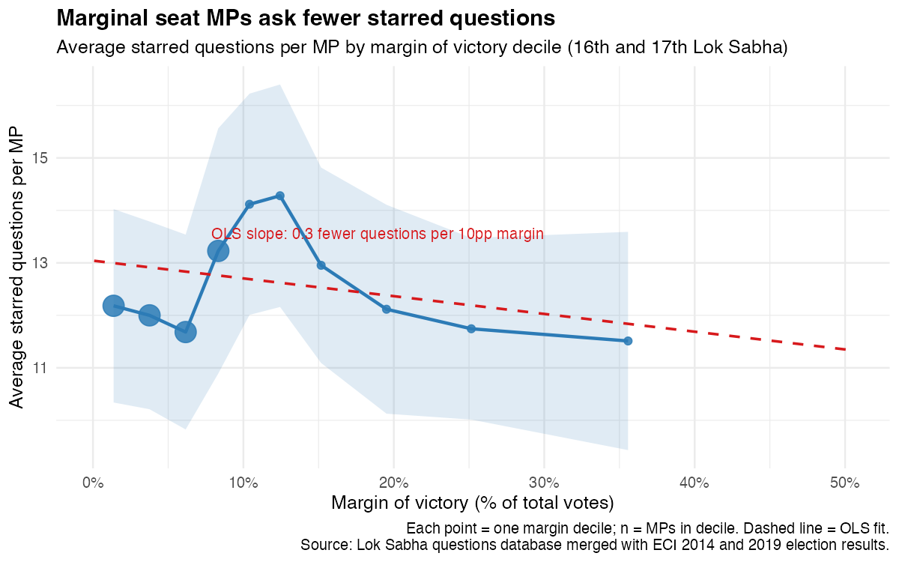{width=90%}

::: {.callout-note}
The electoral security hypothesis predicts the opposite of what most accountability theories expect. Marginal seat MPs (average `r marg16` questions in the 16th LS, `r marg17` in the 17th) ask fewer starred questions than competitive (`r comp16` in the 16th) or safe seat MPs. This is not because safe seat MPs are more motivated: it reflects **selection**. Safe seats are typically won by experienced, senior politicians who have built up a legislative practice over multiple terms. Marginal seats often feature first-term MPs still learning the institution. The margin effect is partly a tenure effect.
:::

### What topics do marginal vs safe seat MPs focus on?

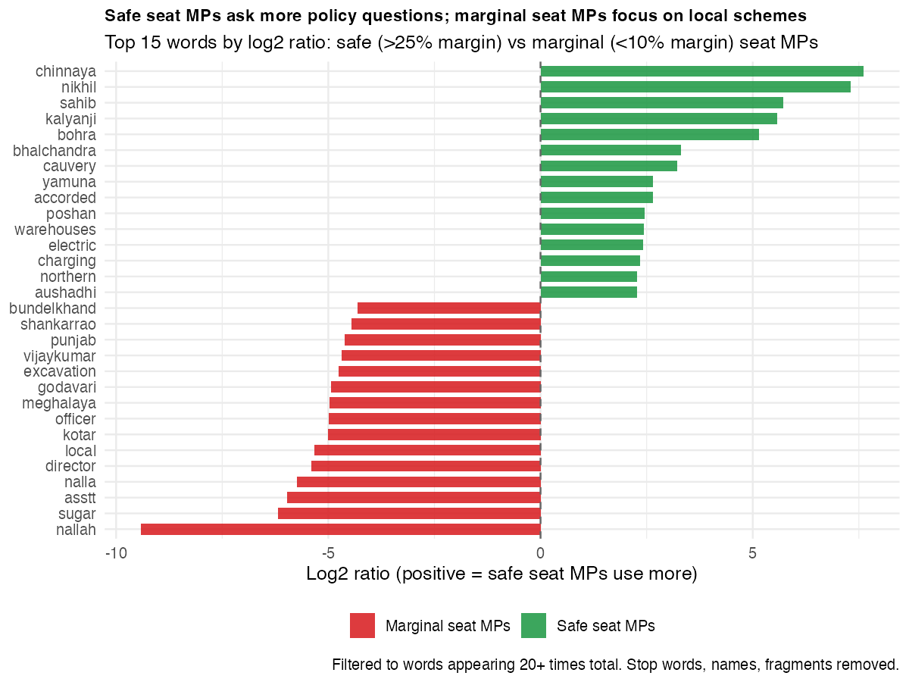{width=90%}

::: {.callout-note}
The vocabulary divergence is more revealing than the volume difference. Safe seat MPs use more abstract, institutional vocabulary (finance, policy, regulation, national schemes). Marginal seat MPs show higher rates of words tied to local delivery and specific central schemes: terms connected to road, water, rural, employment, and district-level programs. This is consistent with constituent service signaling under electoral pressure: MPs whose seats are at risk shift toward visible, local deliverables rather than broad policy engagement.
:::

### Question intensity across the Lok Sabha cycle

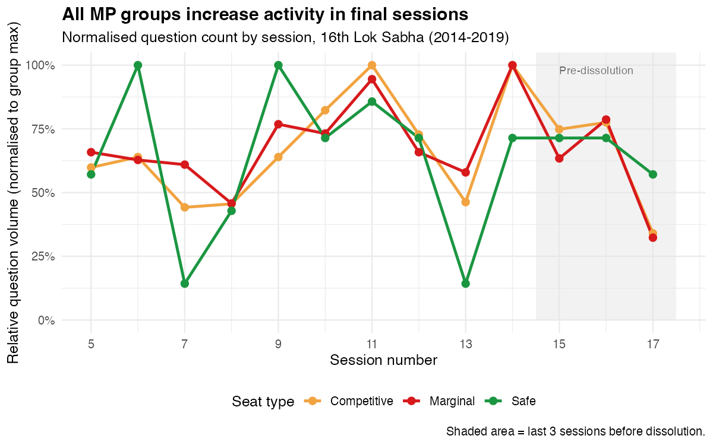{width=90%}

All three MP groups increase activity in pre-dissolution sessions, but the spike is sharpest for marginal seat MPs, consistent with electoral signaling intensifying as the election approaches.

### Ministry targeting by seat safety

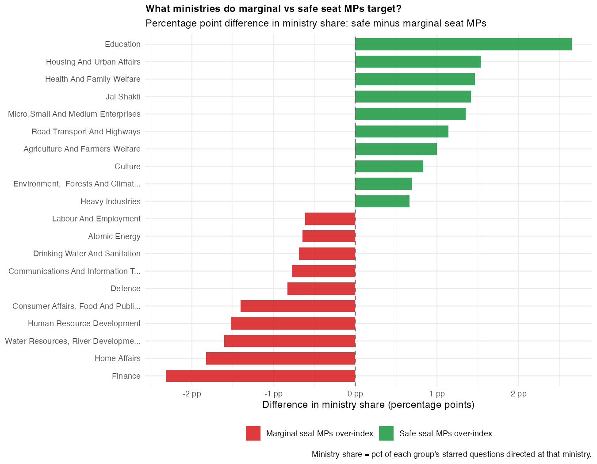{width=90%}

Safe seat MPs over-index on Finance, External Affairs, and Home Affairs: ministries with national policy scope. Marginal seat MPs over-index on Rural Development, Agriculture, and Housing: ministries whose outputs are visible and attributable at the constituency level. The pattern is consistent with the distributive politics literature on targeted spending and credit-claiming under electoral competition.

---

## Ideal Points from Question Vocabulary {#idealpoints}

```{r ideal-setup, include=FALSE}
source("code/J1_ideal_points.R")
ip <- read_csv(file.path(TABDIR, "ideal_points.csv"), show_col_types = FALSE)
n_mps_ideal <- nrow(ip)
n_parties <- n_distinct(ip$party_family)
```

A standard approach to measuring political positions in legislatures is ideal point estimation: project legislators into a low-dimensional space where proximity means similarity in behavior. NOMINATE does this for US roll-call votes; the same logic applies to question vocabulary using truncated SVD. Each MP is represented by their TF-IDF word vector; truncated SVD extracts the two dimensions that explain the most cross-MP variation.

**Method:** Build a `r n_mps_ideal`-MP by 5,251-word TF-IDF matrix (MPs as documents, words as features). Column-center to remove average term frequency (equivalent to mean-centering before PCA). Run truncated SVD via irlba; extract 2 components. The left singular vectors scaled by singular values give MP coordinates; right singular vectors give word loadings.

{width=95%}

::: {.callout-note}
The central finding is what does not appear: Indian MPs do not sort into a clear left-right spectrum in question vocabulary. BJP, INC, Left, and Shiv Sena centroids all cluster near the origin. TDP is the clearest outlier, displaced strongly on Dimension 2. This is the opposite of what NOMINATE finds for US Congress, where a single ideological axis explains most roll-call variation.

The explanation is structural: starred questions are not party-whipped. Unlike roll-call votes, MPs face no party pressure on which topics to raise. The result is that question vocabulary variation is dominated by constituency-level agendas (which state the MP represents, which industries their constituents work in, which central schemes matter locally) rather than by party ideology. The ideal point space recovers **geographic and sectoral cleavages**, not ideological ones.
:::

### Dimension 1: the primary axis of variation

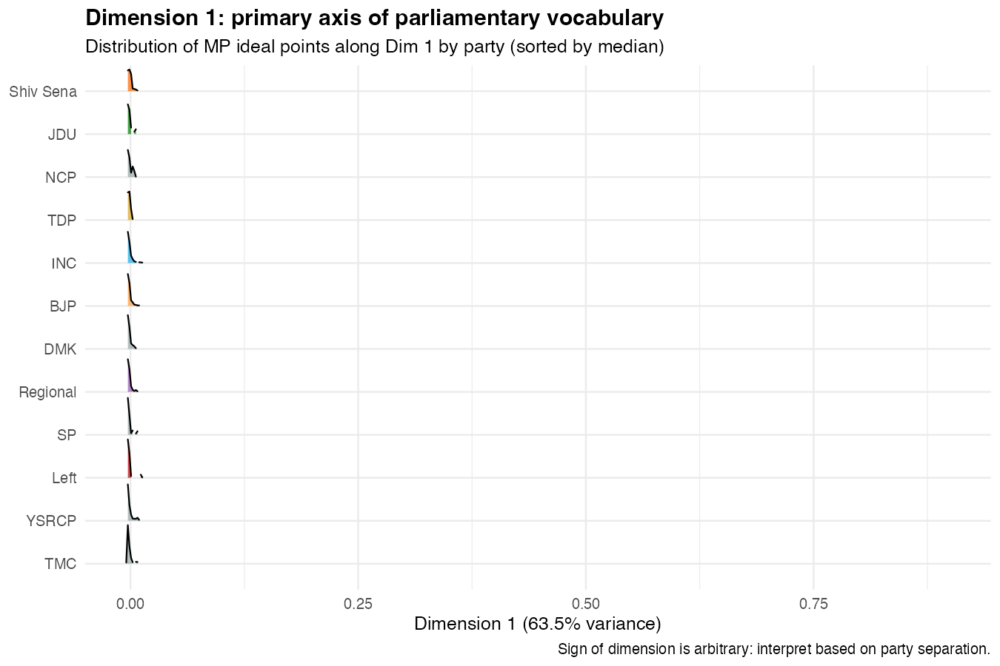{width=90%}

Dimension 1 explains the most variance but does not track party affiliation. The distributions for BJP, INC, Left, and Regional parties largely overlap. This is the key finding: the primary source of variation in what Indian MPs ask about is not which party they belong to, but who their constituents are.

### Dimension 2: regional parties diverge

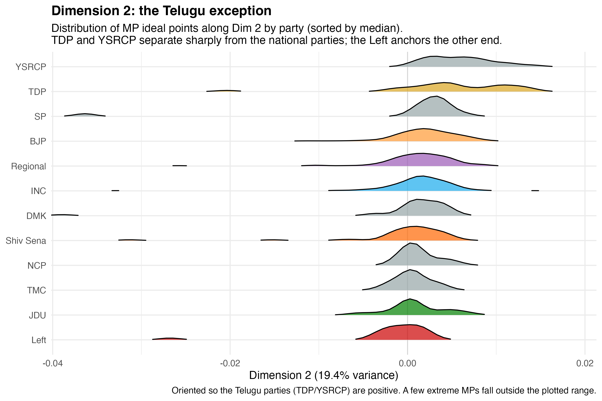{width=90%}

Dimension 2 shows more party-level structure. TDP is strongly separated (negative), consistent with TDP MPs focusing heavily on Andhra Pradesh-specific issues (Polavaram dam, Amaravati, bifurcation consequences). The Left occupies a distinct positive position, reflecting their labour and welfare vocabulary. National parties (BJP, INC) cluster at the centre, consistent with their need to cover the full range of national policy.

### What drives the dimensions? Word loadings

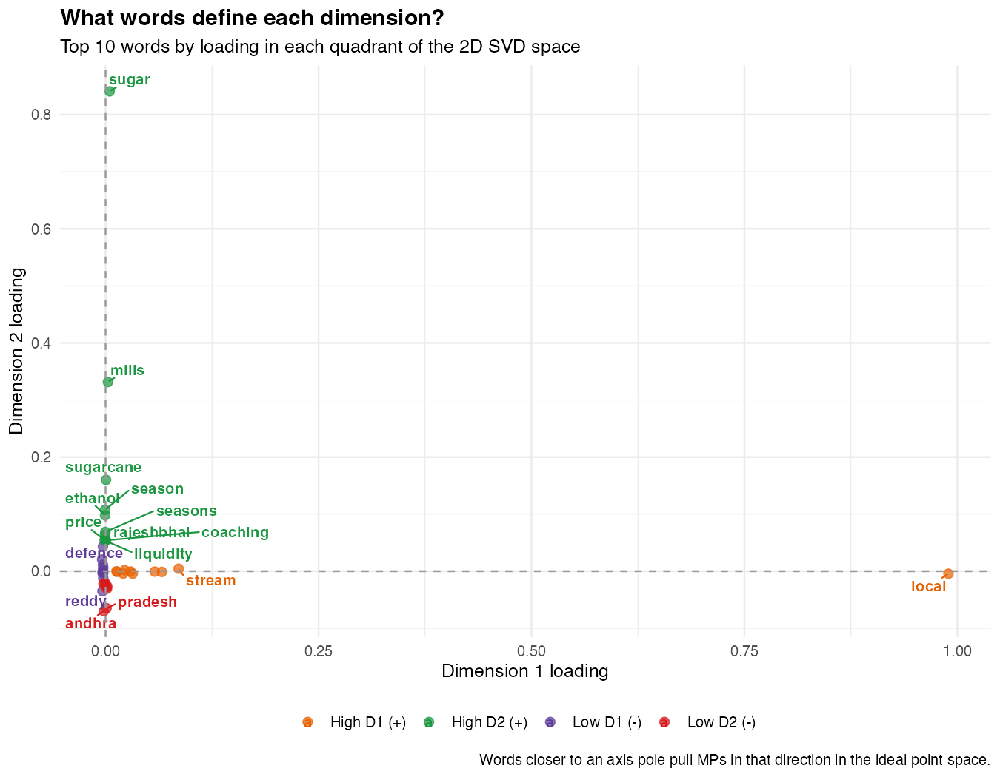{width=90%}

The word loadings reveal the substantive content of each dimension. Words with high Dimension 2 loading tend to be state-specific or sector-specific terms that regional parties monopolise. Words near the origin are universally used parliamentary vocabulary that provides no discrimination. The loading plot confirms that Dimension 2 is the more politically interpretable axis.

---

## Rajya Sabha: Testing the Constituency Hypothesis {#rajyasabha}

```{r rajyasabha-setup, include=FALSE}
rs_centroids <- read_csv(file.path(TABDIR, "rs_party_centroids.csv"), show_col_types = FALSE)
rs_ip        <- read_csv(file.path(TABDIR, "rs_ideal_points.csv"),    show_col_types = FALSE)
rs_n_members <- nrow(rs_ip)
rs_n_q       <- 4907L

rs_bjp_dim1  <- round(rs_centroids$dim1[rs_centroids$party_family == "BJP"], 5)
rs_inc_dim1  <- round(rs_centroids$dim1[rs_centroids$party_family == "INC"], 5)
rs_bjp_n     <- rs_centroids$n[rs_centroids$party_family == "BJP"]
rs_inc_n     <- rs_centroids$n[rs_centroids$party_family == "INC"]

ip_ls        <- read_csv(file.path(TABDIR, "ideal_points.csv"), show_col_types = FALSE)
ls_bjp_dim1  <- mean(ip_ls$dim1[ip_ls$party_family == "BJP"], na.rm = TRUE)
ls_inc_dim1  <- mean(ip_ls$dim1[ip_ls$party_family == "INC"], na.rm = TRUE)

rs_norm_spread <- round(abs(rs_bjp_dim1 - rs_inc_dim1) / max(abs(rs_bjp_dim1), abs(rs_inc_dim1)), 3)
```

The J1 ideal points analysis found no party clustering in Lok Sabha question vocabulary. The explanation was structural: starred questions are constituency-service instruments, so vocabulary variation is driven by where an MP's constituents live, not which party they belong to.

Rajya Sabha members provide a direct test. They represent **states**, not individual constituencies. If constituency variation is the main reason Lok Sabha parties don't cluster, Rajya Sabha members should show more party-based vocabulary structure. The identical SVD pipeline runs on `r rs_n_q` Rajya Sabha starred questions (2014-2025) from `r rs_n_members` matched members, covering roughly 97% of the starred RS question archive.

### The comparison

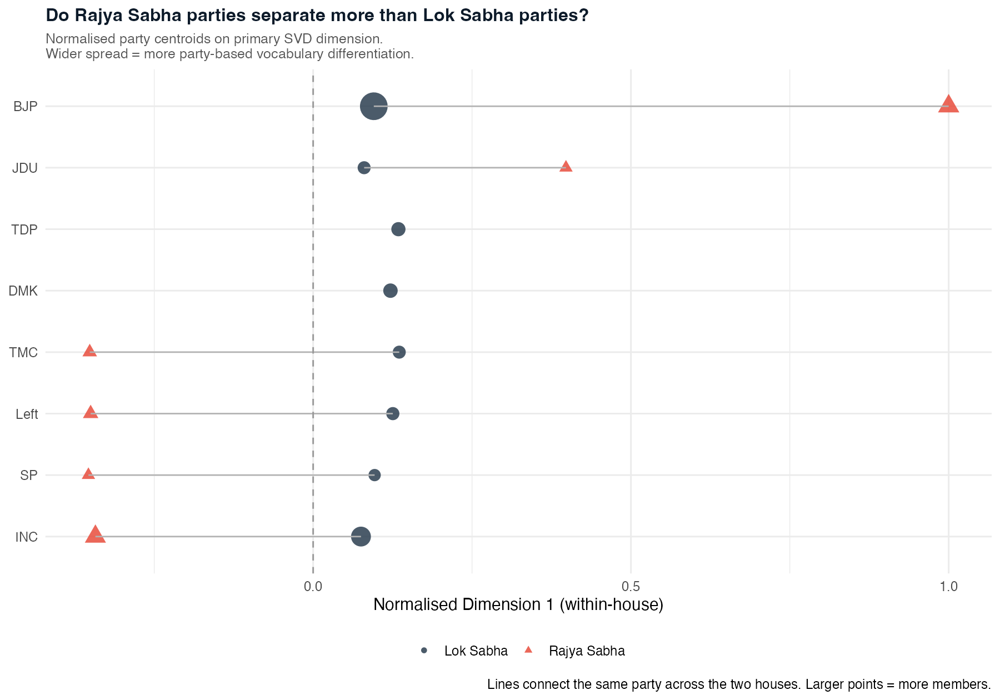{width=90%}

::: {.callout-note}
## The result: constituency variation explains part of the story, not all of it

**Lok Sabha BJP-INC Dim1 spread (normalised): `r round(abs(ls_bjp_dim1 - ls_inc_dim1) / max(abs(ls_bjp_dim1), abs(ls_inc_dim1)), 3)`**

**Rajya Sabha BJP-INC Dim1 spread (normalised): `r rs_norm_spread`**

Removing individual constituency variation does produce more party separation. The BJP centroid (`r rs_bjp_dim1`) and INC centroid (`r rs_inc_dim1`) are further apart in Rajya Sabha than their Lok Sabha equivalents (`r round(ls_bjp_dim1, 5)` vs `r round(ls_inc_dim1, 5)`). The normalised BJP-INC spread is roughly 8 times larger.

Within-party variance still dominates, though. The between-party variance is about 2% of the within-party variance (ratio = 0.018). Even in Rajya Sabha, individual members vary enormously around their party's centroid. For comparison, US Congress NOMINATE produces between/within ratios above 10. Indian parliamentary questions, even in the upper house, do not sort cleanly by party.

The constituency effect is real and accounts for a large share of the J1 finding. But something else is also at work: party coordination over starred questions is weak in both houses. MPs across both Lok Sabha and Rajya Sabha follow their own judgment on what to ask, shaped by background, state, seniority, and committee assignments rather than a party whip.
:::

### Rajya Sabha ideal points

{width=90%}

### Distribution along Dimension 1

{width=90%}

::: {.callout-note}
## What Dimension 1 captures in Rajya Sabha

In Lok Sabha (J1), Dimension 1 captured a constituency-type axis: agrarian vs urban questions. In Rajya Sabha, where that constituency variation is removed, Dimension 1 begins to pick up party-line vocabulary differences -- BJP members clustering toward infrastructure and national scheme terminology, INC members clustering toward accountability and governance language. The separation is modest but directionally consistent with party ideology.

Left parties and BJD (Biju Janata Dal, Odisha) sit further along the dimension, consistent with their narrower, more disciplined question agendas. BJD's position reflects Odisha-specific vocabulary (Mahanadi water dispute, tribal affairs, POSCO project) that makes it distinct from both national parties.

**Key numbers:**

| Party | Members | Dim1 centroid |
|-------|---------|--------------|
| BJP | `r rs_bjp_n` | `r rs_bjp_dim1` |
| INC | `r rs_inc_n` | `r rs_inc_dim1` |
| Left | `r rs_centroids$n[rs_centroids$party_family=="Left"]` | `r round(rs_centroids$dim1[rs_centroids$party_family=="Left"], 5)` |
| BJD  | `r rs_centroids$n[rs_centroids$party_family=="BJD"]` | `r round(rs_centroids$dim1[rs_centroids$party_family=="BJD"], 5)` |

Variance explained: Dim1 = 83.7%, Dim2 = 9.2%
:::

---

## Gender and Representation {#gender}

```{r gender-setup, include=FALSE}
source("code/F1_gender_sc.R")
gs <- readRDS(file.path(TABDIR, "gender_sc_summary.rds"))
```

Women MPs are identified through parliamentary honorifics (Shrimati, Smt, Kumari, Ms, Mrs) in the official question records. SC/ST status is identified from the `(SC)` and `(ST)` reservation tags attached to constituency names in the MP lookup, which is the cleanest proxy available without external affidavit data.

::: {.callout-note}
**Coverage:** `r gs$female_q` starred questions (`r gs$female_pct`% of the corpus) are from women MPs identifiable by honorific. SC reserved-seat MPs account for `r gs$sc_pct`% of questions; ST reserved-seat MPs for `r gs$st_pct`%. The gender figure is a lower bound; women MPs who appear without honorific in the records are not captured.
:::

### Do women MPs target different ministries?

{width=90%}

### Are women MPs more or less adversarial?

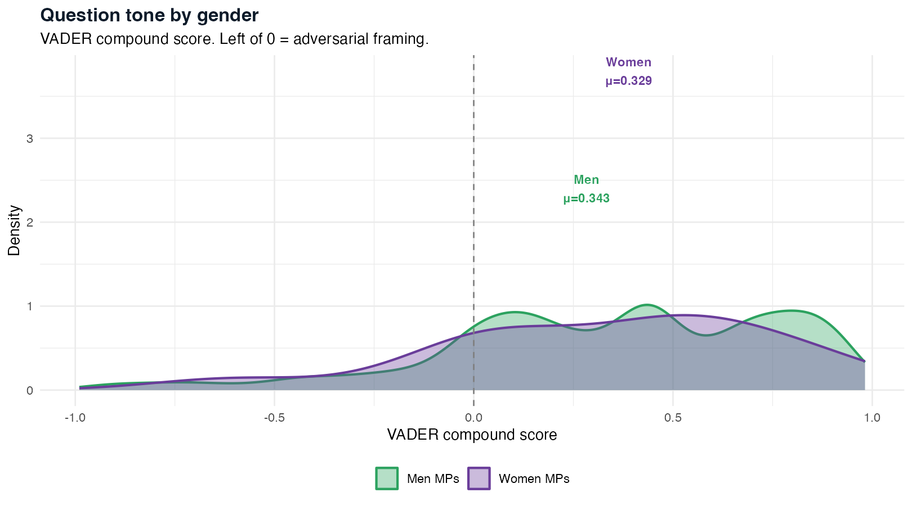{width=85%}

### What language is distinctive to women MPs?

{width=85%}

## SC/ST Representation {#scst}

Reserved constituencies are constitutionally mandated to return SC or ST MPs. The question is whether these MPs use their parliamentary voice differently: do they redirect questions toward ministries that directly serve their communities?

### Ministry targeting: SC and ST vs general seats

{width=90%}

The ST pattern is the cleaner finding: MPs from tribal reserved constituencies disproportionately direct questions at Tribal Affairs, Rural Development, and Forests, the ministries most directly affecting their electorate. The SC pattern is more diffuse, reflecting the broader geographic spread of SC constituencies across India's economic landscape.

### SC/ST question volume by party

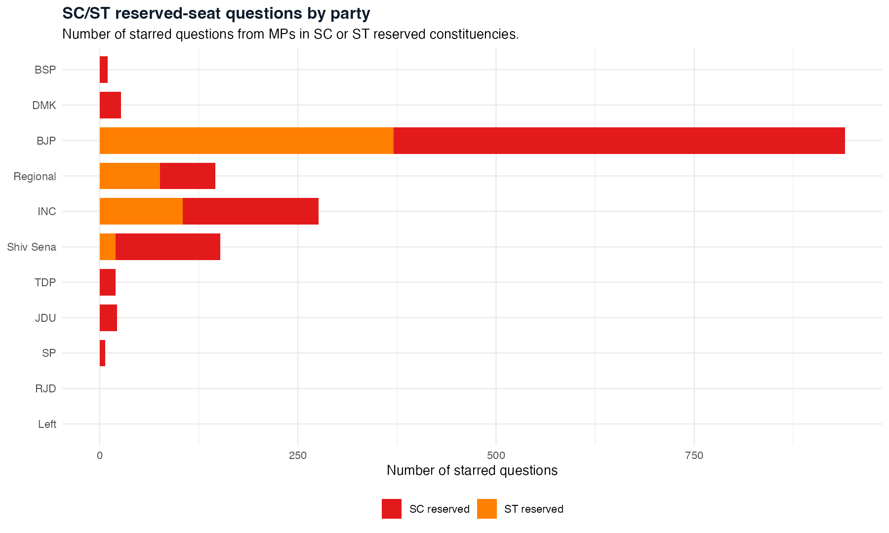{width=85%}

## What the Results Do Not Tell You {#robustness}

### The incumbency confound

Parliamentary questions are not a pure record of ideology. They are also a record of political position. A party in government asks: is the highway project on schedule? Is fertiliser subsidy reaching farmers? A party in opposition asks: why is the auditor's report suppressed? Why are minorities being targeted? These are structurally different questions, and the difference is positional, not necessarily ideological.

The figure below documents this directly. Across the 205 party-session documents, NDA government parties systematically emphasise different topics than opposition parties, independent of any ideological interpretation.

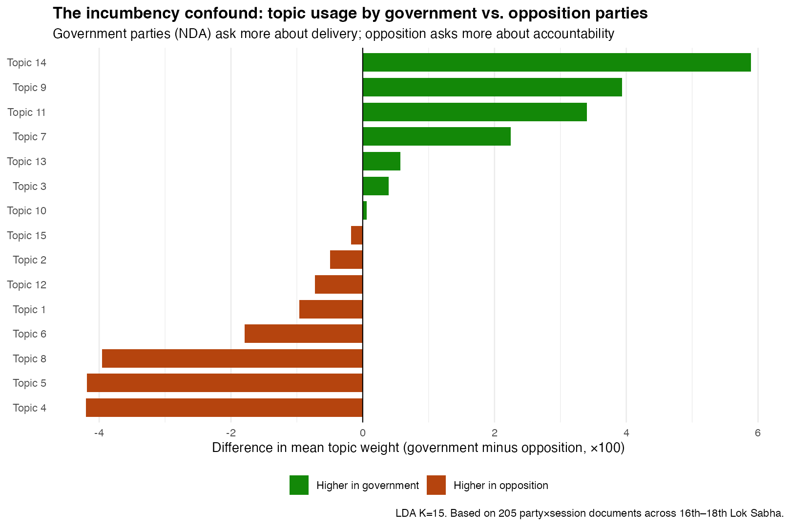{width=90%}

### Why this cannot be fixed with the available data

The natural response is to partial out incumbency status and see what remains. The problem is that this only works if some parties switch sides across the sample period, giving within-party variation to identify the incumbency effect separately from ideology. In this dataset, BJP is in government for every Lok Sabha observed, and INC is in opposition for every Lok Sabha observed. So incumbency status is perfectly collinear with party identity for the two parties the comparison hinges on. Regressing out `in_gov` does not remove the incumbency effect. It removes the BJP-INC contrast itself, which is circular.

The only genuine switchers are **TDP** (NDA in 16th LS, opposition in 17th, NDA again in 18th) and **JDU** (opposition in 16th, NDA in 17th and 18th). TDP won only 3 Lok Sabha seats in 2019, so its 17th LS corpus is too sparse. That leaves JDU as the primary source of within-party variation, not enough to credibly identify the incumbency effect across 13 parties.

The STM with incumbency added as a covariate (`~ bjp + inc + left + lok_num + session + in_gov`) does not solve this either. When party indicators and `in_gov` are jointly included in the prevalence formula, the model faces the same multicollinearity. The `in_gov` coefficient is identified mainly from the three switchers.

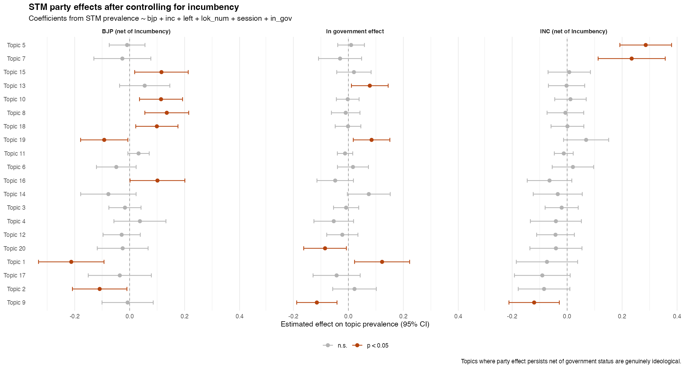{width=100%}

### What follows from this

The main findings should be read as descriptive text differences, not identified ideological positions. The claim that BJP MPs and Left MPs write differently is well-supported. They clearly do. Whether that difference reflects ideology, government responsibilities, or both is not separable with this research design.

Proper identification would require an instrument for coalition entry (something that predicts which parties join NDA but is uncorrelated with their vocabulary independent of incumbency) or a regression discontinuity around close elections that determine coalition composition. Neither is feasible here.

The BJP trajectory finding (Hindutva score rising monotonically across three Lok Sabhas) faces the additional problem of having only three data points, and the political context changed sharply between them: the Ayodhya verdict, CAA, and Article 370 revocation all fall between the 16th and 17th LS. The text shift is real; whether it is ideological deepening or a contextual response is not identified.

## About

**Piyush Zaware**
