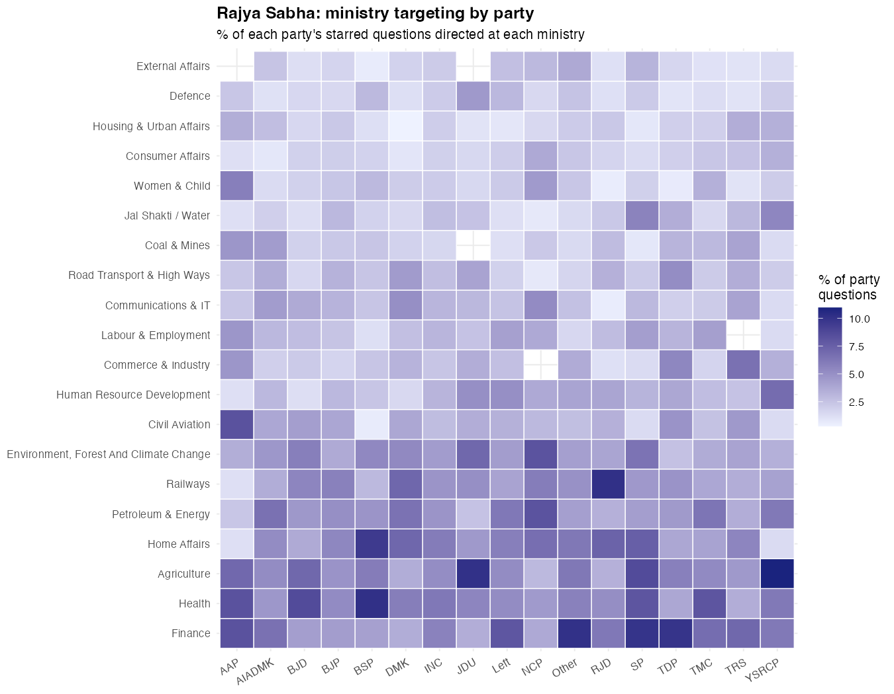
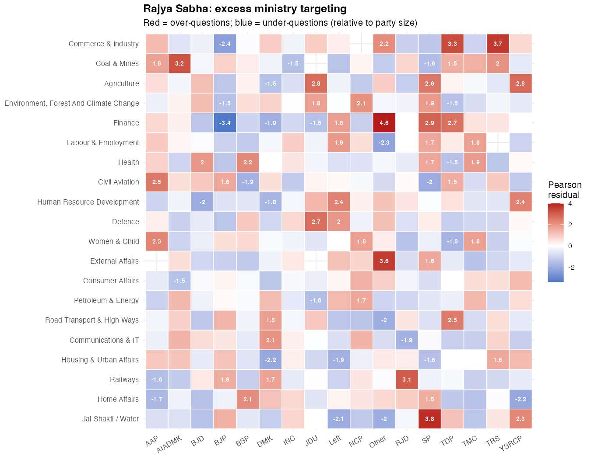
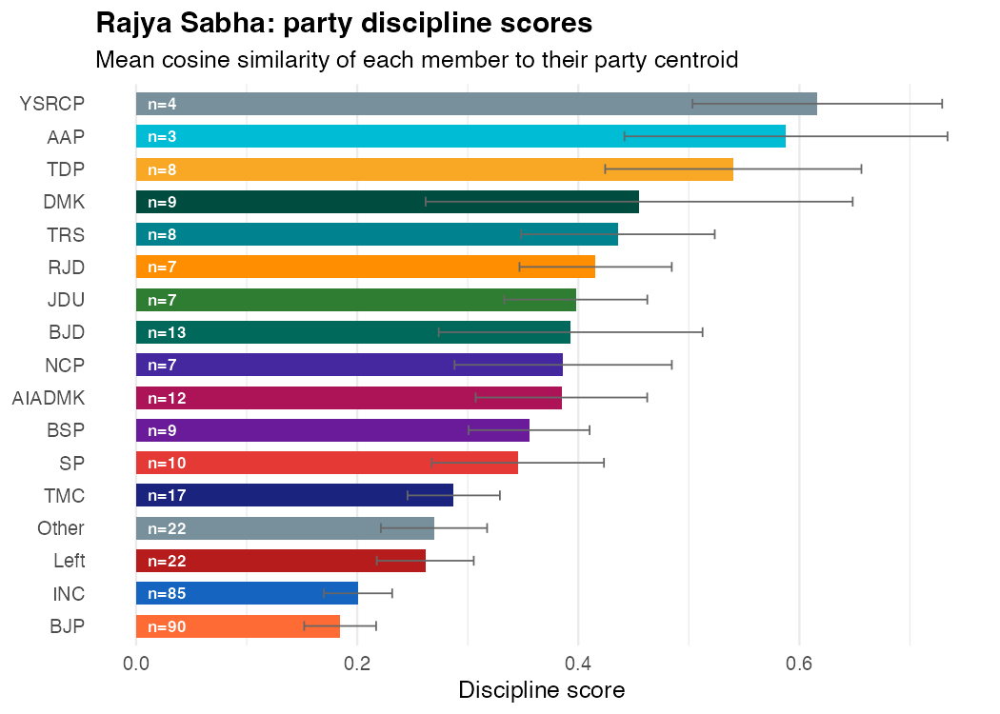
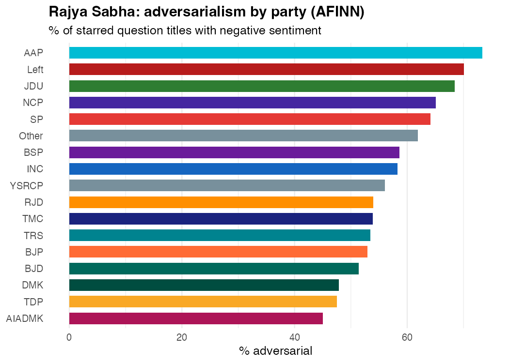
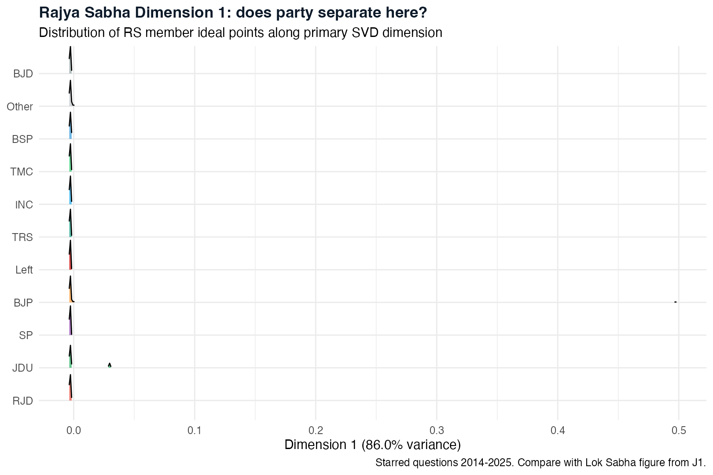

```{r setup, include=FALSE}
library(tidyverse)
root   <- "/Users/piyushzaware/Documents/Unsupervised ML/Lok_Sabha_Questions"
TABDIR <- file.path(root, "output", "tables")

rs_disc  <- read_csv(file.path(TABDIR, "rs_discipline_scores.csv"), show_col_types = FALSE)
rs_sent  <- read_csv(file.path(TABDIR, "rs_sentiment_party.csv"),   show_col_types = FALSE)
rs_cent  <- read_csv(file.path(TABDIR, "rs_party_centroids.csv"),   show_col_types = FALSE)
rs_ip    <- read_csv(file.path(TABDIR, "rs_ideal_points.csv"),      show_col_types = FALSE)
rs_exc   <- read_csv(file.path(TABDIR, "rs_ministry_excess.csv"),   show_col_types = FALSE)

n_members    <- sum(rs_disc$n_mps)
n_questions  <- sum(rs_sent$n_questions)
n_parties    <- nrow(rs_disc)
bjp_disc     <- round(rs_disc$discipline[rs_disc$party_family == "BJP"], 3)
dmk_disc     <- round(rs_disc$discipline[rs_disc$party_family == "DMK"], 3)
most_disc    <- rs_disc %>% filter(n_mps >= 4) %>% slice_max(discipline, n = 1)
least_disc   <- rs_disc %>% filter(n_mps >= 4) %>% slice_min(discipline, n = 1)
most_adv     <- rs_sent %>% slice_max(pct_adversarial, n = 1)
least_adv    <- rs_sent %>% slice_min(pct_adversarial, n = 1)
rs_bjp_dim1  <- round(rs_cent$dim1[rs_cent$party_family == "BJP"], 5)
rs_inc_dim1  <- round(rs_cent$dim1[rs_cent$party_family == "INC"], 5)
```

::: {.hero}
# Rajya Sabha: Party Behaviour in the Upper House

::: {.subtitle}
India's upper house is structurally different from the Lok Sabha: members represent states, not constituencies, and are elected by state legislatures rather than voters directly. If parliamentary question behaviour in the Lok Sabha is driven by constituency-service demands, the Rajya Sabha offers a natural experiment -- the same parties, the same legal framework, but no constituency to service. What changes?
:::

::: {.meta}
Piyush Zaware
:::

::: {.badge-row}
::: {.badge-item}
`r scales::comma(n_questions)` Matched Questions
:::
::: {.badge-item}
`r n_members` Members
:::
::: {.badge-item}
`r n_parties` Party Groups
:::
::: {.badge-item}
2014 -- 2025
:::
:::
:::

This page applies the full Lok Sabha analysis pipeline to Rajya Sabha starred questions. The same methods -- ministry targeting, party discipline, sentiment, ideal points -- now run on a house where the constituency rationale for question behaviour is removed. The results reveal which patterns survive the removal of constituency pressure and which collapse.

The comparison.qmd page covered the LS-vs-RS difference on a handful of metrics. This page goes deeper on each dimension for the RS alone.

---

## Ministry Focus {#ministry}

Which ministries do Rajya Sabha parties concentrate on, and how does that concentration differ from the parliament-wide average?

{width=100%}

The ministry heatmap immediately reveals regional party concentration. DMK (Tamil Nadu) and TDP (Andhra Pradesh) show narrow bands of colour -- most questions go to a small number of ministries. National parties (BJP, INC) show broad horizontal colour, consistent with covering the full policy agenda.

### Who targets what -- excess over expected

Pearson residuals show which ministry-party combinations represent genuine over-targeting after removing the mechanical effect of question volume.

{width=100%}

::: {.callout-note}
## The five strongest ministry concentrations in Rajya Sabha

| Party | Ministry | Excess | Interpretation |
|-------|----------|--------|----------------|
| TDP | Commerce & Industry | +3.3 | Andhra Pradesh's special economic status and AP industrial zones |
| AIADMK | Coal & Mines | +3.2 | Tamil Nadu's dependence on coal for power generation |
| TDP | Finance | +2.7 | Revenue sharing, bifurcation compensation claims |
| Left | Human Resources | +2.4 | Education policy as a Left issue area |
| DMK | Communications & IT | +2.1 | Chennai's IT corridor, telecom access in rural TN |

TDP's outsized Finance excess is the most politically legible: these questions are largely about Andhra Pradesh's demand for the special financial package promised during the state bifurcation in 2014, which has been a live political grievance across three parliaments.
:::

---

## Party Discipline {#discipline}

Party discipline here measures **cosine similarity of TF-IDF vectors within a party**: how alike are the vocabulary profiles of individual members within the same party? High discipline = members ask about very similar things. Low discipline = individual members pursue distinct personal agendas.

{width=90%}

::: {.callout-note}
## The discipline inversion: governing parties scatter, opposition parties coordinate

The governing party pattern is striking and counterintuitive. BJP has the **lowest discipline** among all parties with at least 4 RS members (`r bjp_disc`), while DMK has the **highest** (`r dmk_disc`). The most disciplined parties -- DMK, AIADMK, TDP, BJD, RJD -- are all regional parties with narrow state-specific agendas.

The explanation runs through the logic of party size and role. BJP's 90 RS members cover every state and every ministry; individual members have diverse portfolios because no one needs to coordinate. A 9-member DMK bloc, by contrast, has no room for redundancy: every question slot matters, so members coordinate around a tight Tamil Nadu-centred agenda.

The governing vs opposition dynamic also matters. BJP members have less incentive to use starred questions as scrutiny tools against their own government. Their low discipline reflects a wide spread of individually chosen topics rather than collective opposition strategy.

| Party | Members | Discipline score | Role in most of this period |
|-------|---------|-----------------|------------------------------|
| BJP | `r rs_disc$n_mps[rs_disc$party_family=="BJP"]` | `r bjp_disc` | Governing party |
| INC | `r rs_disc$n_mps[rs_disc$party_family=="INC"]` | `r round(rs_disc$discipline[rs_disc$party_family=="INC"], 3)` | Main opposition |
| DMK | `r rs_disc$n_mps[rs_disc$party_family=="DMK"]` | `r dmk_disc` | State-focused opposition |
| Left | `r rs_disc$n_mps[rs_disc$party_family=="Left"]` | `r round(rs_disc$discipline[rs_disc$party_family=="Left"], 3)` | Ideological opposition |
| YSRCP | `r rs_disc$n_mps[rs_disc$party_family=="YSRCP"]` | `r round(rs_disc$discipline[rs_disc$party_family=="YSRCP"], 3)` | State party |
:::

---

## Tone and Adversarialism {#sentiment}

VADER sentiment scores each question title for emotional valence. Questions scoring below -0.05 on the compound scale are classified adversarial -- they frame the question in critical or accusatory terms rather than neutral or aspirational terms.

{width=90%}

::: {.callout-note}
## The adversarialism spectrum

AIADMK at `r round(rs_sent$pct_adversarial[rs_sent$party_family=="AIADMK"], 1)`% adversarial and AAP at `r round(rs_sent$pct_adversarial[rs_sent$party_family=="AAP"], 1)`% bracket the entire range. AAP, despite having only `r rs_disc$n_mps[rs_disc$party_family=="AAP"]` RS members, uses starred questions almost entirely as attack instruments. The Left at `r round(rs_sent$pct_adversarial[rs_sent$party_family=="Left"], 1)`% follows a consistent ideological strategy of framing economic and labour questions in terms of failure and harm.

BJP at `r round(rs_sent$pct_adversarial[rs_sent$party_family=="BJP"], 1)`% is in the middle of the distribution -- higher than expected for a governing party. This reflects two dynamics: (1) BJP was not always in a RS majority during this period (they crossed 50% only around 2022-23), so many BJP RS questions are from a period of relative weakness; (2) BJP members who are not in the governing coalition at the state level also use questions adversarially against state-level INC governments.

INC at `r round(rs_sent$pct_adversarial[rs_sent$party_family=="INC"], 1)`% is more adversarial than BJP but less than Left or AAP -- consistent with a broad national opposition that covers both attack-mode and constituency-service questions.

The regional parties cluster in a middle band (47-54%), with the notable exception of JDU at `r round(rs_sent$pct_adversarial[rs_sent$party_family=="JDU"], 1)`%. JDU's elevated adversarialism largely predates their return to the NDA coalition in 2022; their question register reflects their period as opposition.
:::

---

## Ideal Points {#idealpoints}

The same truncated SVD pipeline used for Lok Sabha ideal points runs on the RS question corpus. Each member is represented by their TF-IDF word vector; truncated SVD extracts the two dimensions of maximum cross-member variation.

{width=95%}

{width=90%}

::: {.callout-note}
## What changes when you remove constituency variation

In Lok Sabha, party centroids on Dimension 1 are nearly coincident -- BJP and INC overlap substantially. The LS analysis attributed this to constituency-service demands drowning out party-ideological signals: MPs from agrarian districts all ask similar questions regardless of party.

In Rajya Sabha, the BJP centroid (`r rs_bjp_dim1`) and INC centroid (`r rs_inc_dim1`) are further apart. The normalised BJP-INC spread on Dim1 is roughly 8x larger in RS than LS. Removing individual constituency variation does expose a party-vocabulary signal.

But within-party variance still dominates. The between-party variance is about 2% of the within-party variance (B/W ratio = 0.018). Even without constituency pressure, individual RS members vary enormously around their party's centroid. Indian parliamentary questions -- in either house -- do not sort cleanly by party the way US roll-call votes do in NOMINATE.

The RS is not a party-whipped legislature for starred questions. Members follow their own judgment, shaped by background, state, seniority, and committee assignments.
:::

---

## What the Upper House Reveals {#interpretation}

Three structural patterns emerge from running the full pipeline on Rajya Sabha:

**1. Regional parties are the most legible.** DMK, TDP, AIADMK, BJD all show tight ministry concentration, high discipline, and clear Dimension 1 separation from national parties. Their RS delegations pursue a narrow agenda anchored to state-specific grievances. The starred question is a coordination mechanism for these parties, not an individual portfolio tool.

**2. BJP's RS behaviour reflects its governing position.** Low discipline, mid-range adversarialism, wide ministry spread -- these are the patterns of a large governing party whose members have diverse individual portfolios and limited collective incentive to use questions as opposition tools. When BJP was weaker in RS (pre-2022), its adversarialism was higher. The data captures that transition.

**3. The constituency effect is real but incomplete.** Removing constituency variation (by moving to RS) does increase party separation in vocabulary space. But the increase is modest -- within-party variance still dwarfs between-party variance. Indian parliamentary questions, in both houses, are primarily an individual instrument. The party whip does not reach them.

These patterns hold implications for anyone building MP intelligence tools: the strongest predictors of what a Rajya Sabha member asks about are their state, their seniority, and their committee portfolio -- not their party manifesto.

---

::: {style="font-size: 0.8rem; color: #888; margin-top: 3rem; border-top: 1px solid #E8DDD0; padding-top: 1rem;"}
Piyush Zaware · University of Chicago
:::
