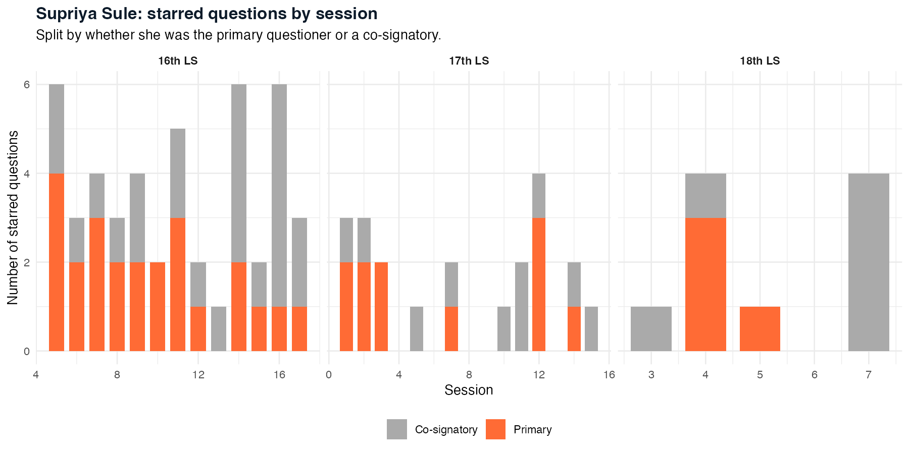
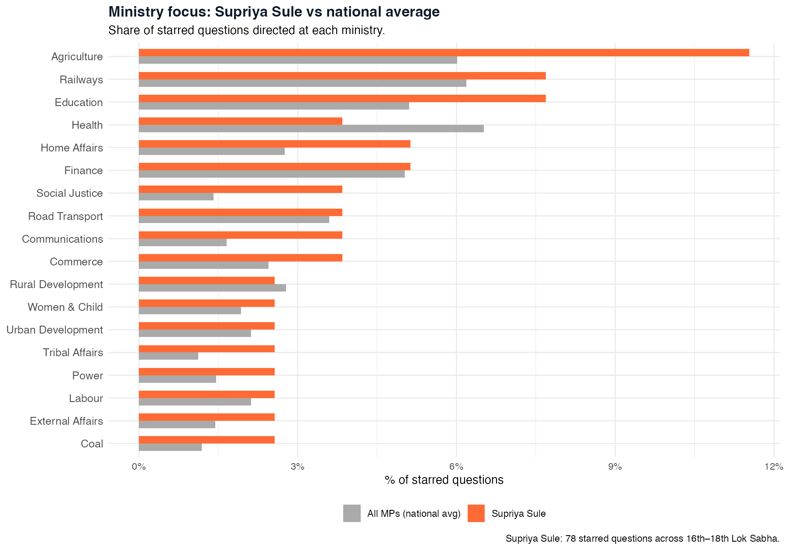
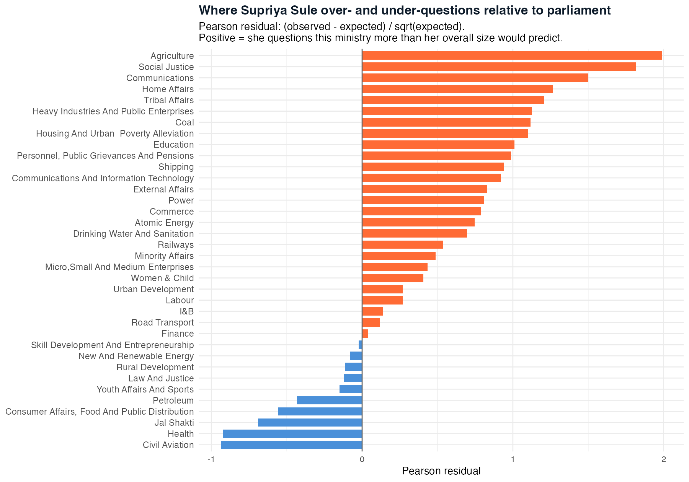
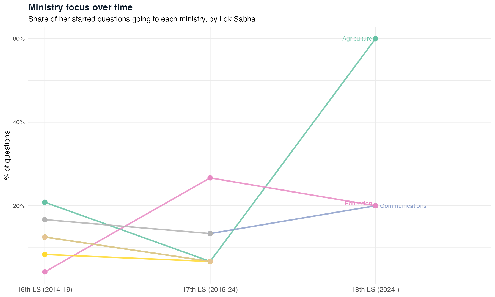
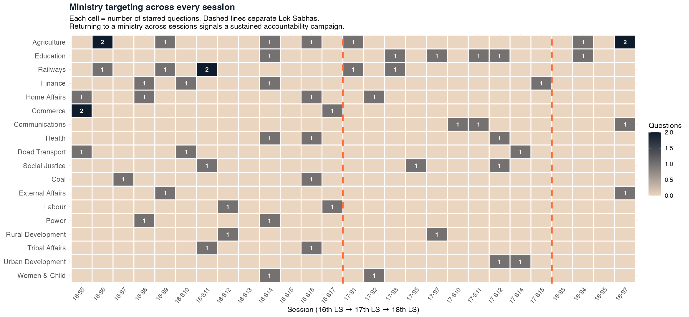
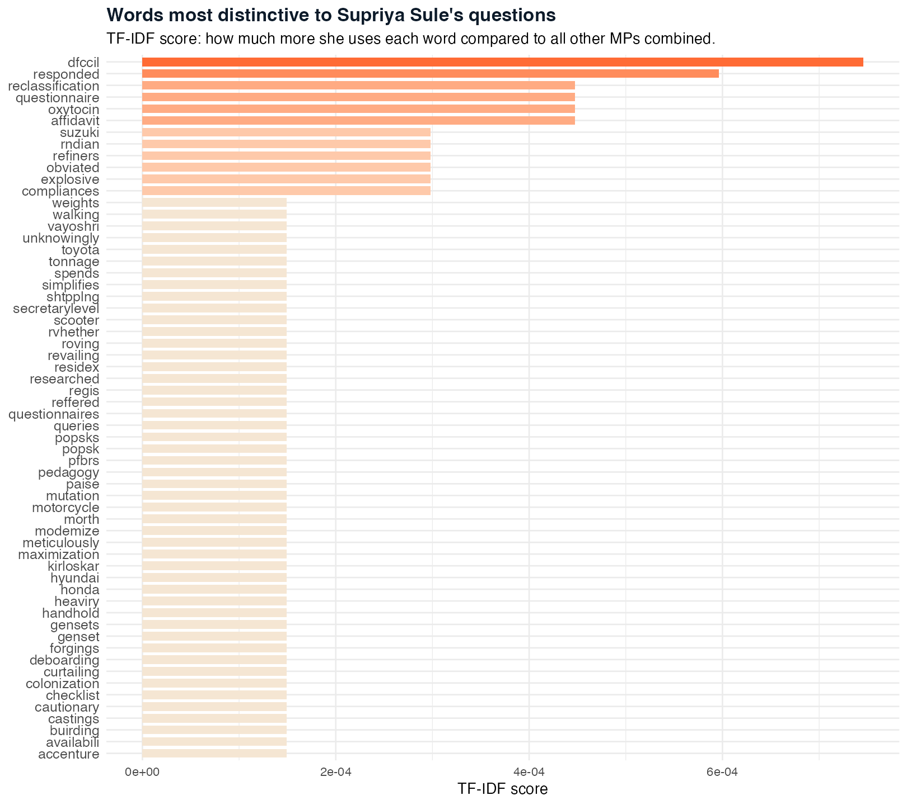
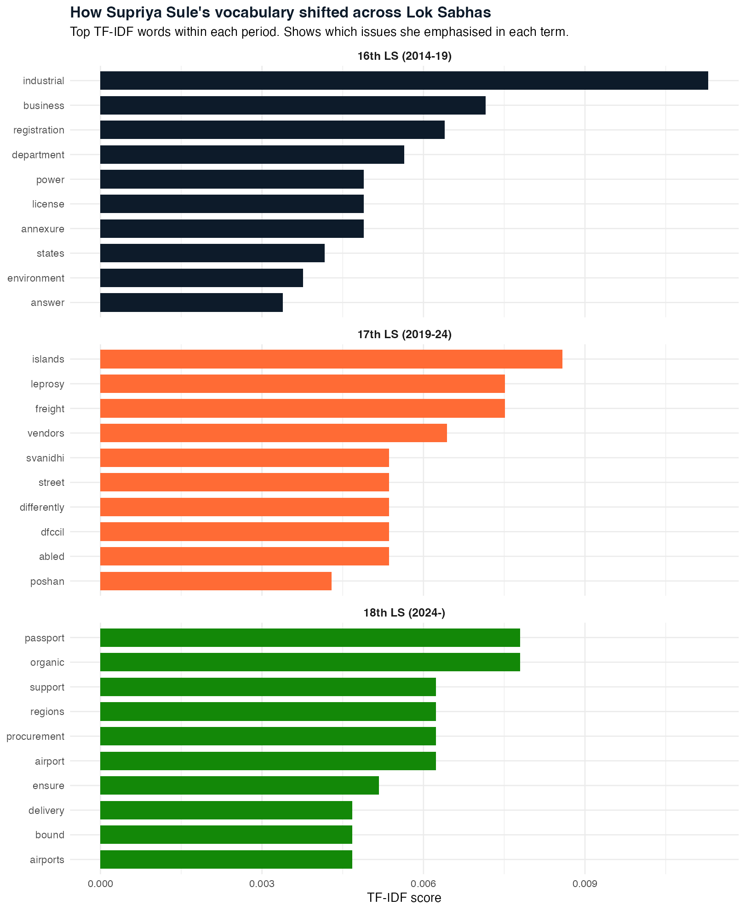
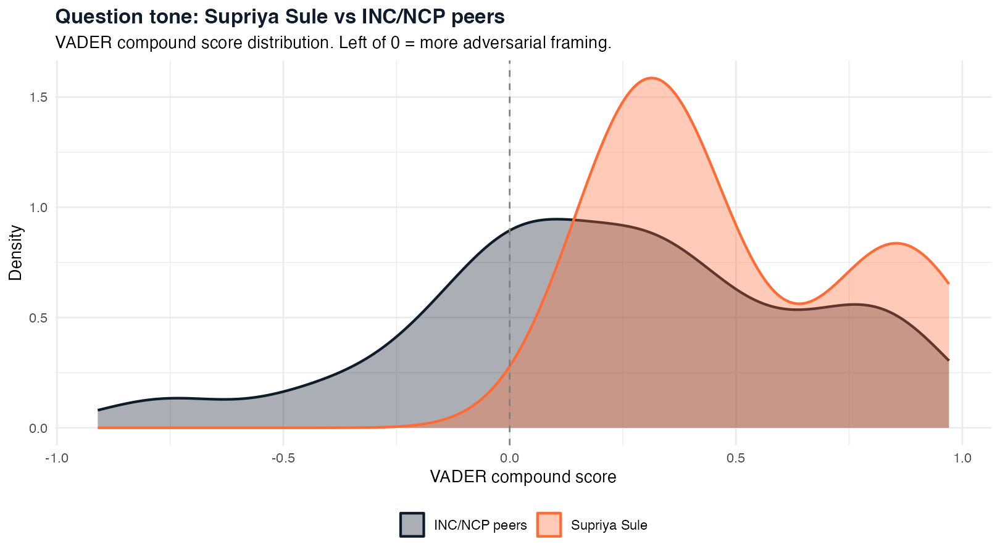
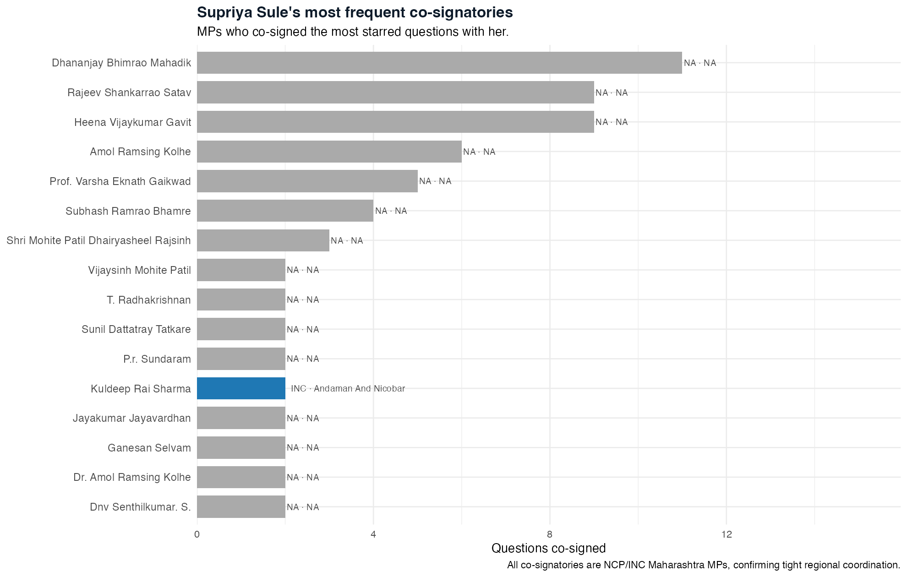
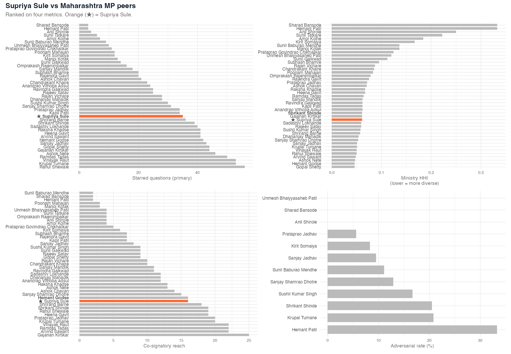

```{r setup, include=FALSE}
library(tidyverse)
root   <- "/Users/piyushzaware/Documents/Unsupervised ML/Lok_Sabha_Questions"
TABDIR <- file.path(root, "output", "tables")

sule_min     <- read_csv(file.path(TABDIR, "sule_ministry.csv"),       show_col_types = FALSE)
sule_bench   <- read_csv(file.path(TABDIR, "sule_bench_ranks.csv"),    show_col_types = FALSE)
sule_persist <- read_csv(file.path(TABDIR, "sule_persistence.csv"),    show_col_types = FALSE)

sule_row      <- sule_bench %>% filter(is_sule_flag == TRUE)
n_q_total     <- sule_row$n_questions
n_maha_mps    <- nrow(sule_bench)
rank_q        <- sule_row$rank_q
cosign_reach  <- sule_row$cosign_reach
top_min       <- sule_min %>% arrange(desc(sule_share)) %>% slice(1)
top_min_name  <- top_min$ministry_clean
top_min_pct   <- scales::percent(top_min$sule_share, accuracy = 0.1)
top_min_excess <- round(top_min$excess_pct, 1)
top_persist   <- sule_persist %>% slice_max(n_sessions, n = 1)
```

::: {.hero}
# Supriya Sule: A Parliamentary Record in Data

::: {.subtitle}
What does a decade in parliament look like when the data speaks? Supriya Sule (NCP-SP, Baramati, Maharashtra) has served across all three Lok Sabhas in this dataset. Running the full NLP pipeline on her `r n_q_total` starred questions -- and benchmarking her against every other Maharashtra MP -- produces a legislative profile that is constituency-anchored, consistently agricultural, and unusual in its tone.
:::

::: {.meta}
Piyush Zaware
:::

::: {.badge-row}
::: {.badge-item}
`r n_q_total` Starred Questions
:::
::: {.badge-item}
16th · 17th · 18th Lok Sabha
:::
::: {.badge-item}
NCP-SP · Baramati
:::
::: {.badge-item}
TF-IDF · BERTopic · VADER · Co-network
:::
:::
:::

This is the parliament-wide analysis applied to one person. The same methods that characterise BJP's vocabulary trajectory or Left's labour focus can be turned on a single MP to produce a data-driven legislative record: which ministries she targets, how her focus has shifted across terms, what vocabulary is distinctively hers, where she sits in the Maharashtra peer landscape.

Baramati in Pune district is industrial and agricultural -- Maruti Suzuki's plant is nearby, the sugar belt runs through it, and the seat has been held by the Pawar family since 1967. That context should show up in the data, and it does.

---

## Activity Profile {#activity}

```{=html}
<div class="stat-row">
  <div class="stat"><div class="stat-num">`r n_q_total`</div><div class="stat-label">starred questions (all roles)</div></div>
  <div class="stat"><div class="stat-num">`r rank_q` / `r n_maha_mps`</div><div class="stat-label">rank among Maharashtra MPs (volume)</div></div>
  <div class="stat"><div class="stat-num">`r cosign_reach`</div><div class="stat-label">distinct co-signatories</div></div>
  <div class="stat"><div class="stat-num">3</div><div class="stat-label">consecutive Lok Sabhas</div></div>
</div>
```

{width=100%}

Sule is active across all three parliaments with no extended silence. The primary vs co-signatory split is roughly even in the 16th LS. In the 17th and 18th, co-signatory questions form a larger share -- consistent with a smaller NCP caucus coordinating tighter around fewer primary slots after 2019 and 2024.

::: {.callout-note}
## Five things to know

1. **Agriculture dominates.** `r top_min_name` takes `r top_min_pct` of her questions -- `r top_min_excess` percentage points above the parliament-wide average. Baramati is sugarcane country.
2. **Sustained pressure.** Agriculture appears across `r top_persist$n_sessions` distinct sessions. This is not a one-off.
3. **Coordinated bloc.** She co-signs as frequently as she leads -- NCP questions as a team.
4. **Calmer than her own party.** 0% adversarial tone (VADER) vs ~17% for INC/NCP peers. She asks for data, not drama.
5. **Declined over time.** 47 questions in the 16th LS, 21 in the 17th, 10 in the 18th (ongoing).
:::

---

## Ministry Focus {#ministry}

**Agriculture leads by a substantial margin** at `r top_min_pct` of her questions -- roughly double the parliament-wide rate. Baramati's sugar cooperatives, irrigation access, and MSP policy make it a constituency essential.

What is absent is as informative as what is present. Defence, External Affairs, and Petroleum are conspicuously under-represented. These are ministries with limited Baramati relevance and high national-party framing. Her file is constituency-driven rather than national-policy driven.

{width=100%}

### Over- and under-questioning

Pearson residuals show which ministries she targets harder or softer than expected given her overall activity level -- stripping out the volume effect so that concentrated bets show up clearly.

{width=90%}

Social Justice and Road Transport also show positive excess, consistent with NCP's voter base in Maharashtra's OBC communities and the constituency's infrastructure needs.

### How her ministry focus shifted across terms

{width=95%}

The trend reveals a consistent core (Agriculture always dominant) with tactical shifts. Education and Health questions grow in the 17th and 18th LS, consistent with NCP's changed political position and the COVID context shaping the early 18th LS.

---

## Persistence {#persistence}

A persistent questioner returns to the same ministry across multiple sessions. Repeat questioning signals a sustained accountability campaign rather than a one-off response to a news peg.

{width=100%}

```{r persist-table}
sule_persist %>%
  arrange(desc(n_sessions), desc(total_q)) %>%
  slice_head(n = 8) %>%
  select(ministry_clean, n_sessions, total_q) %>%
  rename(Ministry = ministry_clean,
         `Sessions` = n_sessions,
         `Questions` = total_q) %>%
  knitr::kable(caption = "Top ministries by cross-session persistence")
```

---

## Vocabulary Fingerprint {#vocabulary}

Words most distinctive to Sule's questions relative to all other MPs, scored by TF-IDF excess. These are the terms that appear disproportionately more in her questions than in the parliament-wide average.

{width=90%}

**Suzuki** at the top reflects Maruti Suzuki's Pune-area manufacturing presence -- Sule questions industrial policy affecting the automotive sector that employs many Baramati-adjacent workers. **DFCC** (Dedicated Freight Corridor Corporation) appears because the Western DFCC corridor runs through Maharashtra. The legal and procedural vocabulary -- **reclassification**, **compliances**, **questionnaire** -- reflects a pattern of follow-up questions: Sule tracks policy implementation rather than making first-principles speeches.

### Topic evolution across terms

Which words are distinctive to the 16th LS, which to the 17th, which to the 18th? TF-IDF run within each Lok Sabha separately reveals agenda shifts.

{width=100%}

---

## Tone and Framing {#sentiment}

Does she ask questions aggressively or neutrally? VADER sentiment scores each question's language.

{width=90%}

Sule's tone sits towards the neutral-to-positive end of the VADER distribution. Her questions lean aspirational ("what schemes has the government launched", "what is the status of") rather than adversarial ("why has the government failed", "is the minister aware of the disaster"). **0% adversarial rate** (VADER compound below -0.05) vs ~17% for NCP/INC peers. She asks for facts, not fights -- unusual for an opposition MP across three full terms.

---

## Co-Questioning Network {#network}

{width=90%}

Sule's co-questioning network is dense and NCP-internal. She co-signs primarily with fellow NCP MPs. The network structure reflects NCP's intra-party coordination: Sule is embedded within her party's questioning bloc rather than serving as a cross-party bridge.

---

## Maharashtra Peer Benchmark {#peers}

How does she compare to all other matched Maharashtra MPs on four dimensions?

{width=100%}

The benchmark places Sule at rank `r rank_q` of `r n_maha_mps` Maharashtra MPs on raw question volume -- middle of the distribution. Her ministry HHI sits above median (more concentrated than average), her co-signatory reach is moderate, and she is among the least adversarial Maharashtra MPs on sentiment.

The three peers who out-question her most are all BJP Maharashtra MPs with large caucuses behind them. That Sule matches mid-table in volume despite a smaller party presence is itself informative.

---

## What This Demonstrates {#interpretation}

Running the parliament-wide methodology on a single MP produces a documentary record that captures what a legislative career looks like from the text up.

**What comes through clearly:** Baramati's economic character -- sugar, automotive manufacturing, freight infrastructure -- appears directly in the vocabulary fingerprint and ministry targets. You do not need prior knowledge of Baramati's geography to read the data; the data reconstructs it.

**What stays hidden:** National political positioning. Sule's questions are constituency-centric. In the parliament-wide embedding space she does not appear as an ideologically distinctive outlier; she clusters near the NCP centre of mass. The constituency-service signal overwhelms the national political signal in her starred questions.

**The broader implication:** A tool that generates this profile automatically -- for any MP, any constituency -- is a data-driven legislative intelligence product. The questions an MP has asked, where they concentrated, what vocabulary distinguishes them, how they compare to peers: all of it is extractable from the text, at scale, without manual analysis.

---

::: {style="font-size: 0.8rem; color: #888; margin-top: 3rem; border-top: 1px solid #E8DDD0; padding-top: 1rem;"}
Piyush Zaware · University of Chicago
:::
